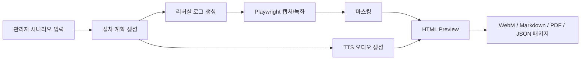

# Manual Video Agent

사내 시스템 사용 시나리오를 입력하면 로컬 PC에서 사용 매뉴얼 영상과 문서 패키지를 생성하는 MVP입니다.

현재 목표는 운영계 시스템을 바로 자동 조작하는 것이 아니라, 샘플 사내 시스템 화면을 대상으로 전체 제작 흐름을 검증하는 것입니다. 내부 LLM/RAG/VLM/Reranker, `playwright-mcp`, MeloTTS, HyperFrames는 `.env`로 켜고 끌 수 있는 어댑터 경계까지 포함합니다.

## 무엇을 만드는 시스템인가

관리자가 "MES에서 LOT 조회 방법 영상 만들기" 같은 시나리오를 입력하면 다음 산출물을 만듭니다.

- 브라우저 화면 녹화 영상
- HTML preview
- Markdown 매뉴얼
- PDF 매뉴얼 placeholder
- 실행 action plan JSON
- 승인/리허설/마스킹 로그
- TTS 오디오
- 산출물 manifest

완성된 영상은 이 시스템 안에서 장기 보관하지 않습니다. 생성된 패키지를 관리자가 확인한 뒤 별도 저장소나 게시 시스템에서 관리하는 구조입니다.

## 현재 구현 상태

| 영역 | 상태 | 설명 |
|---|---|---|
| 로컬 웹앱 | 구현 | FastAPI, Jinja template, vanilla JS 기반 |
| 홈 화면 UI | 구현 | `D:\Python\appendix\AI Center DESIGN.md`의 AI Center inspired 디자인 적용 |
| 샘플 사내 시스템 | 구현 | `/sample`에서 테스트용 MES LOT 조회 화면 제공 |
| 파이프라인 API | 구현 | `/api/pipeline/run`으로 산출물 생성 |
| Action plan | 구현 | 기본은 입력값 라벨/버튼 텍스트 기반 semantic action planner, 옵션으로 내부 LLM planner 호출 |
| 브라우저 캡처 | 구현 | Playwright action plan 기반 범용 캡처 및 WebM 녹화 |
| 로그인 처리 | 구현 | 로그인 없음, 사용자가 직접 로그인, `.env` ID/password 자동 입력 지원 |
| 마스킹 | 구현 | 기본 이미지 마스킹과 로그 생성 |
| `.env` 설정 | 구현 | `D:\Python\appendix\appendix.md` 기반 내부 API 설정 로드 |
| 설정 상태 UI/API | 구현 | key 원문 없이 구성 여부만 표시 |
| `playwright-mcp` | 어댑터 구현 | manifest 생성 또는 live stdio JSON-RPC 실행 |
| 내부 LLM/RAG/Reranker | 어댑터 구현 | `.env`로 켜면 RAG/Reranker context와 LLM JSON planner 호출 |
| VLM | 설정 준비 | `.env`와 상태 API만 준비, 화면 검수 호출은 다음 단계 |
| MeloTTS | 어댑터 구현 | 설치되어 있으면 한국어 wav 생성, 없으면 silent wav fallback |
| HyperFrames | 어댑터 구현 | skills 설치/확인, composition 생성, `.env`로 켜면 CLI 렌더 시도 후 실패 시 WebM fallback |
| OpenCode | 어댑터 구현 | 생성 패키지 디렉터리에서 `opencode run` 비대화형 agent pass 실행 |
| 감사/게이트 | 구현 | `AuditLog`, `RiskPolicy`, `ApprovalGate`, degraded reason을 package manifest에 기록 |
| PDF | placeholder | 정식 렌더러가 아닌 최소 PDF 생성 |
| MP4 | 옵션 | HyperFrames 렌더 성공 시 MP4, 기본은 WebM |

## 파이프라인



현재 기본값은 안전한 로컬/fallback 모드입니다. `.env`에서 `MANUAL_AGENT_ENABLE_INTERNAL_PLANNER`, `MANUAL_AGENT_ENABLE_BROWSER_AGENT`, `MANUAL_AGENT_PLAYWRIGHT_MCP_MODE=live`, `MANUAL_AGENT_TTS_PROVIDER`, `MANUAL_AGENT_VIDEO_RENDERER`, `MANUAL_AGENT_ENABLE_HYPERFRAMES_SKILLS`, `MANUAL_AGENT_ENABLE_OPENCODE` 등을 켜면 내부 LLM/RAG/Reranker, Playwright 기반 브라우저 판단 루프, Playwright MCP, MeloTTS, HyperFrames skills/render, OpenCode 어댑터를 실제 실행합니다.

## 환경 준비

이 프로젝트의 Python 표준 버전은 `3.10.19`입니다. Python 3.11 이상을 전제로 설치하지 않습니다.

### 1. Python 3.10.19 가상환경

Windows에서 Python Launcher가 설치되어 있으면 다음처럼 만듭니다.

```powershell
py -3.10 -m venv .venv
.\.venv\Scripts\Activate.ps1
python --version
```

`python --version`은 다음처럼 보여야 합니다.

```text
Python 3.10.19
```

필요 패키지를 설치합니다.

```powershell
python -m pip install --upgrade pip
python -m pip install fastapi "uvicorn[standard]" pydantic pillow playwright httpx pytest
python -m playwright install chromium
```

Playwright 공식 문서는 `pip install playwright` 후 `playwright install`로 브라우저 바이너리를 설치하는 흐름을 안내합니다. 이 프로젝트는 Chromium만 사용하므로 `python -m playwright install chromium`을 기본으로 둡니다.

사내망에서 Playwright 브라우저 다운로드가 막히면 사내 프록시 또는 사내 캐시 경로를 먼저 설정해야 합니다.

```powershell
$env:HTTPS_PROXY="http://proxy.example:8080"
python -m playwright install chromium
```

### 2. FFmpeg

MP4 변환, HyperFrames 렌더링, 오디오 mux 단계에는 `ffmpeg`가 필요합니다. 현재 MVP는 WebM을 직접 생성하므로 필수는 아니지만, HyperFrames 실연동 단계부터는 설치해야 합니다.

```powershell
winget install --id Gyan.FFmpeg -e
ffmpeg -version
```

### 3. Playwright MCP

백엔드 파이프라인은 기본 캡처에는 Python Playwright를 직접 사용합니다. `playwright-mcp`는 리허설 단계에서 action plan을 실제 브라우저 tool call로 검증하는 MCP 서버입니다.

Node.js와 `npx`가 필요합니다.

```powershell
node -v
npx -v
```

Codex MCP 서버로 추가할 때는 다음 명령을 사용합니다.

```powershell
codex mcp add playwright npx "@playwright/mcp@latest"
```

수동으로 설정할 경우 `~/.codex/config.toml`에 다음 구성을 추가합니다.

```toml
[mcp_servers.playwright]
command = "npx"
args = ["@playwright/mcp@latest"]
```

Windows에서 `npx`가 인식되지 않으면 Node.js 설치 경로가 `PATH`에 들어갔는지 먼저 확인합니다.

앱에서 실제 MCP live session을 켜려면 `.env`를 다음처럼 설정합니다.

```env
MANUAL_AGENT_PLAYWRIGHT_MCP_MODE=live
MANUAL_AGENT_PLAYWRIGHT_MCP_COMMAND=npx @playwright/mcp@latest --headless
```

`live` 모드에서는 백엔드가 MCP 서버를 stdio JSON-RPC로 실행하고 `initialize`, `tools/list`, `tools/call`을 호출합니다. 실행 로그는 `playwright_mcp_execution.json`에 남습니다. 실패해도 파이프라인은 Python Playwright 캡처 또는 placeholder 캡처로 계속 진행합니다.

### 4. HyperFrames

HyperFrames는 HTML 기반 video composition을 preview/render하는 Node.js 계열 도구입니다. 현재 MVP는 HyperFrames를 직접 호출하지 않고 HTML preview와 Playwright WebM을 생성합니다. MP4 품질 렌더링으로 넘어갈 때 HyperFrames 어댑터를 연결합니다.

필요 조건:

- Node.js `22` 이상
- FFmpeg
- 사내망에서 npm registry 접근 또는 사내 npm mirror

설치/검증:

```powershell
node -v
ffmpeg -version
npx hyperframes init manual-video-renderer
cd manual-video-renderer
npx hyperframes preview
npx hyperframes render
```

에이전트가 HyperFrames composition을 더 정확히 작성하게 하려면 HyperFrames skills를 설치합니다.

```powershell
npx skills add heygen-com/hyperframes
```

앱에서 skills 설치/확인 커맨드를 실행하게 하려면 다음 값을 켭니다.

```env
MANUAL_AGENT_ENABLE_HYPERFRAMES_SKILLS=true
MANUAL_AGENT_HYPERFRAMES_SKILLS_COMMAND=npx hyperframes skills --codex
```

이 명령은 렌더링 전에 실행되고 결과는 `hyperframes_skills.json`에 저장됩니다. 사내망에서 npm 접근이 막혀 실패해도 composition 생성과 fallback 영상 생성은 계속됩니다.

HyperFrames 저장소 자체를 clone해서 개발할 경우 Git LFS가 필요할 수 있습니다.

```powershell
winget install GitHub.GitLFS
git lfs install
```

### 5. MeloTTS 한국어 TTS

현재 MVP는 silent wav placeholder를 생성합니다. 실제 한국어 내레이션을 만들려면 MeloTTS 어댑터를 붙입니다.

권장 방식은 별도 TTS 가상환경을 두는 것입니다. 이 앱의 표준 Python은 `3.10.19`지만, MeloTTS 공식 문서는 Ubuntu 20.04/Python 3.9 개발·테스트 기준과 Windows Docker 사용 권장을 함께 안내합니다. Windows native 설치가 실패하면 WSL 또는 별도 Python 3.9 TTS 환경으로 분리하는 편이 안전합니다.

Python 3.10.19에서 먼저 시도할 수 있는 설치 흐름:

```powershell
git clone https://github.com/myshell-ai/MeloTTS.git third_party\MeloTTS
python -m pip install -e third_party\MeloTTS
python -m unidic download
```

한국어 음성 생성 smoke test:

```powershell
python -c "from melo.api import TTS; model=TTS(language='KR', device='cpu'); spk=model.hps.data.spk2id; model.tts_to_file('안녕하세요. 사내 시스템 사용 방법을 안내합니다.', spk['KR'], 'kr.wav', speed=1.0)"
```

VRAM 6GB 환경에서는 먼저 `device='cuda:0'`를 시도하고, OOM이 나면 `device='cpu'`로 운영합니다.

```powershell
python -c "import torch; print(torch.cuda.is_available())"
```

### 6. 설치 확인

```powershell
python -c "import fastapi, pydantic, PIL, playwright; print('python runtime ok')"
python -m playwright install --help
node -v
npx -v
ffmpeg -version
```

### 7. OpenCode

OpenCode는 생성된 산출물 패키지 디렉터리에서 비대화형 agent pass를 실행하는 선택 기능입니다. OpenCode CLI 문서의 `opencode run [message..]` 형태를 사용합니다.

설치/확인:

```powershell
npm install -g opencode-ai
opencode --help
opencode run --help
```

앱에서 OpenCode를 켜려면 `.env`를 다음처럼 설정합니다.

```env
MANUAL_AGENT_ENABLE_OPENCODE=true
MANUAL_AGENT_OPENCODE_COMMAND=opencode run --format json
MANUAL_AGENT_OPENCODE_AGENT=build
MANUAL_AGENT_OPENCODE_MODEL=
MANUAL_AGENT_OPENCODE_TIMEOUT_SECONDS=600
```

OpenCode 어댑터는 각 job 패키지에 `opencode_prompt.md`를 만들고, 그 prompt를 `opencode run` 마지막 인자로 넘깁니다. 기본 prompt는 `hyperframes/index.html`, `hyperframes/hyperframes_manifest.json`, `opencode_notes.md`만 편집 대상으로 제한합니다. 실행 결과는 `opencode_agent.json`에 저장됩니다.

## 실행 방법

```powershell
python -m uvicorn backend.app.main:app --host 127.0.0.1 --port 8000
```

브라우저에서 다음 주소를 엽니다.

```text
http://127.0.0.1:8000
```

샘플 사내 시스템 화면은 다음 주소입니다.

```text
http://127.0.0.1:8000/sample
```

## 사용 방법

1. 홈 화면에서 요청문, 대상 URL, 계정 역할, 완료 조건, 입력값을 확인합니다.
2. 로그인 창이 나오는 시스템이면 `로그인 방식`을 고릅니다.
3. 기본 대상 URL은 `/sample`입니다.
4. `파이프라인 실행`을 누릅니다.
5. 실행이 끝나면 홈 화면에 산출물 링크가 표시됩니다.
6. `preview.html`, WebM 영상, Markdown, PDF, JSON 로그를 확인합니다.
7. 최종 영상 파일은 관리자가 별도 보관합니다.

기본 planner는 selector를 모르는 상태에서도 입력값 이름을 화면 label/placeholder/name과 맞춰 채우고, 요청문에 `조회`, `검색`, `상세` 같은 안전한 읽기 동작이 있으면 같은 텍스트의 버튼을 찾아 클릭합니다. 예를 들어 입력값 `LOT=LOT-001`과 요청문 `LOT 조회 후 상세 화면 확인`은 `LOT` 입력칸 채우기, `조회` 버튼 클릭, `상세 보기` 버튼 클릭으로 실행됩니다. 저장, 제출, 삭제 같은 쓰기 동작은 기본 semantic planner의 자동 클릭 대상이 아니며, 운영 전에는 LLM action plan 검수나 Action JSON 편집 UI로 확정해야 합니다.

### 로그인 방식

로그인 방식은 작업마다 선택할 수 있습니다.

- `로그인 없음`: 기본값입니다. 로그인 페이지가 없는 샘플 또는 이미 접근 가능한 URL에 사용합니다.
- `직접 로그인`: Playwright가 headed 브라우저를 띄우고 사용자가 직접 로그인합니다. 로그인 브라우저 오른쪽 아래에 `로그인 완료` 버튼이 표시되며, 사용자가 이 버튼을 누르면 다음 단계로 넘어갑니다. `로그인 완료 selector`를 지정하면 selector가 보이거나 버튼을 누르는 것 중 먼저 만족된 신호를 사용합니다.
- `.env ID/password`: `.env`에 저장한 ID/password와 selector를 사용해 로그인 폼을 자동 입력합니다. 비밀번호 원문은 UI, `/api/config/status`, request artifact, audit log, capture action log에 기록하지 않습니다.

직접 로그인은 OTP, SSO, 사내 인증 앱처럼 자동 입력하면 안 되는 흐름에 사용합니다. ID/password 자동 입력은 테스트 계정이나 승인된 자동화 계정에서만 사용합니다.

수동 로그인 브라우저는 녹화하지 않습니다. 로그인 완료 신호를 받은 뒤 저장된 세션 상태만 녹화 브라우저로 넘겨 실제 매뉴얼 영상 캡처를 시작합니다.

## 산출물 구조

산출물은 기본적으로 `output/jobs/<job_id>/` 아래에 생성됩니다.

```text
output/jobs/<job_id>/
  preview.html
  manual_video_agent_usage.webm
  manual.md
  manual.pdf
  action_plan.json
  approval_log.json
  audit_log.jsonl
  capture_action_log.json
  planner_trace.json
  rehearsal_log.json
  playwright_mcp_calls.json
  playwright_mcp_execution.json
  masking_log.json
  hyperframes_skills.json
  opencode_prompt.md
  opencode_agent.json
  video_render.json
  package_manifest.json
  captures/
  masked/
  tts/
    tts_metadata.json
  hyperframes/
    index.html
    hyperframes_manifest.json
```

`MANUAL_AGENT_OUTPUT_DIR`을 설정하면 기본 출력 경로를 바꿀 수 있습니다.

`package_manifest.json`은 기존 주요 산출물 목록인 `artifacts`와 함께 운영 검수용 `supporting_artifacts`를 제공합니다. `supporting_artifacts`에는 요청 원문, audit log, planner trace, rehearsal log, Playwright MCP call manifest, TTS metadata, HyperFrames composition, OpenCode prompt/result처럼 문제 재현과 관리자 검수에 필요한 파일 경로가 들어갑니다.

`degradations`에는 fallback이 일어난 사유를 1급 필드로 남깁니다. 예를 들어 MeloTTS 미설치로 silent wav를 만든 경우 `tts_silent_fallback`, HyperFrames 렌더 실패로 WebM fallback을 사용한 경우 `hyperframes_fallback_video`가 기록됩니다.

## `.env` 설정

내부 API 접속값은 `.env`로 관리합니다. 예시 파일은 [.env.example](.env.example)에 있습니다.

```powershell
Copy-Item .env.example .env
```

그 다음 `.env`에서 `MANUAL_AGENT_*` 값을 사내 발급값으로 채웁니다.

동일한 key가 `.env`와 프로세스 환경변수에 모두 있으면 프로세스 환경변수를 우선합니다. 배포/테스트에서 임시 출력 경로나 모델명을 바꿀 때 `.env`를 수정하지 않아도 됩니다.

주요 설정은 다음과 같습니다.

```text
MANUAL_AGENT_OPENAI_API_KEY
MANUAL_AGENT_DEP_TICKET
MANUAL_AGENT_SEND_SYSTEM_NAME
MANUAL_AGENT_USER_ID
MANUAL_AGENT_USER_TYPE
MANUAL_AGENT_LLM_BASE_URL
MANUAL_AGENT_LLM_MODEL
MANUAL_AGENT_ENABLE_INTERNAL_PLANNER
MANUAL_AGENT_REQUEST_TIMEOUT_SECONDS
MANUAL_AGENT_VLM_BASE_URL
MANUAL_AGENT_VLM_MODEL
MANUAL_AGENT_RAG_INSERT_URL
MANUAL_AGENT_RAG_RETRIEVE_URL
MANUAL_AGENT_RAG_DELETE_URL
MANUAL_AGENT_RAG_API_KEY
MANUAL_AGENT_RAG_INDEX_NAME
MANUAL_AGENT_RAG_PERMISSION_GROUPS
MANUAL_AGENT_ENABLE_RAG_CONTEXT
MANUAL_AGENT_RERANKER_URL
MANUAL_AGENT_RERANKER_MODEL
MANUAL_AGENT_ENABLE_RERANKER
MANUAL_AGENT_PLAYWRIGHT_MCP_MODE
MANUAL_AGENT_PLAYWRIGHT_MCP_COMMAND
MANUAL_AGENT_PLAYWRIGHT_EXECUTABLE_PATH
MANUAL_AGENT_ENABLE_BROWSER_AGENT
MANUAL_AGENT_BROWSER_AGENT_MAX_STEPS
MANUAL_AGENT_LOGIN_MODE
MANUAL_AGENT_LOGIN_USERNAME_SELECTOR
MANUAL_AGENT_LOGIN_PASSWORD_SELECTOR
MANUAL_AGENT_LOGIN_SUBMIT_SELECTOR
MANUAL_AGENT_LOGIN_SUCCESS_SELECTOR
MANUAL_AGENT_LOGIN_USERNAME
MANUAL_AGENT_LOGIN_PASSWORD
MANUAL_AGENT_LOGIN_MANUAL_TIMEOUT_SECONDS
MANUAL_AGENT_LOGIN_CREDENTIALS_TIMEOUT_SECONDS
MANUAL_AGENT_OUTPUT_DIR
MANUAL_AGENT_TTS_PROVIDER
MANUAL_AGENT_TTS_DEVICE
MANUAL_AGENT_TTS_LANGUAGE
MANUAL_AGENT_TTS_SPEAKER
MANUAL_AGENT_TTS_SPEED
MANUAL_AGENT_VIDEO_RENDERER
MANUAL_AGENT_HYPERFRAMES_COMMAND
MANUAL_AGENT_ENABLE_HYPERFRAMES_SKILLS
MANUAL_AGENT_HYPERFRAMES_SKILLS_COMMAND
MANUAL_AGENT_ENABLE_OPENCODE
MANUAL_AGENT_OPENCODE_COMMAND
MANUAL_AGENT_OPENCODE_AGENT
MANUAL_AGENT_OPENCODE_MODEL
MANUAL_AGENT_OPENCODE_TIMEOUT_SECONDS
```

운영 어댑터를 켜는 예시:

```env
MANUAL_AGENT_ENABLE_INTERNAL_PLANNER=true
MANUAL_AGENT_ENABLE_RAG_CONTEXT=true
MANUAL_AGENT_ENABLE_RERANKER=true
MANUAL_AGENT_ENABLE_BROWSER_AGENT=true
MANUAL_AGENT_BROWSER_AGENT_MAX_STEPS=8
MANUAL_AGENT_PLAYWRIGHT_MCP_MODE=live
MANUAL_AGENT_TTS_PROVIDER=melotts
MANUAL_AGENT_TTS_DEVICE=cuda:0
MANUAL_AGENT_VIDEO_RENDERER=hyperframes
MANUAL_AGENT_ENABLE_HYPERFRAMES_SKILLS=true
MANUAL_AGENT_ENABLE_OPENCODE=true
```

VRAM 6GB에서 MeloTTS가 OOM을 내면 `MANUAL_AGENT_TTS_DEVICE=cpu`로 바꿉니다.

설정 변경 후 앱을 재시작합니다.

로그인 자동 입력 예시:

```env
MANUAL_AGENT_LOGIN_MODE=credentials
MANUAL_AGENT_LOGIN_USERNAME_SELECTOR=#username
MANUAL_AGENT_LOGIN_PASSWORD_SELECTOR=#password
MANUAL_AGENT_LOGIN_SUBMIT_SELECTOR=button[type="submit"]
MANUAL_AGENT_LOGIN_SUCCESS_SELECTOR=.main-dashboard
MANUAL_AGENT_LOGIN_USERNAME=test-user
MANUAL_AGENT_LOGIN_PASSWORD=replace-with-password
MANUAL_AGENT_LOGIN_CREDENTIALS_TIMEOUT_SECONDS=30
```

사용자 직접 로그인 예시:

```env
MANUAL_AGENT_LOGIN_MODE=manual
MANUAL_AGENT_LOGIN_SUCCESS_SELECTOR=.main-dashboard
MANUAL_AGENT_LOGIN_MANUAL_TIMEOUT_SECONDS=120
```

`MANUAL_AGENT_LOGIN_SUCCESS_SELECTOR`를 비워도 수동 로그인 브라우저의 `로그인 완료` 버튼으로 진행할 수 있습니다.

설정 상태는 홈 화면의 `.env 설정 상태` 또는 다음 API에서 확인합니다.

```http
GET /api/config/status
```

비밀값 원문은 UI/API 응답에 표시하지 않습니다. `.env`는 `.gitignore`에 포함되어 커밋되지 않습니다.

## Docker 없는 사내 PC 배포

사내 PC마다 Python, Node, 프록시, 루트 CA, Defender/EDR 정책이 다르므로 운영 배포는 개발자 설치 절차와 분리합니다. 권장 방식은 온라인 빌드 PC에서 오프라인 번들 zip을 만들고, 대상 PC에서는 짧은 ASCII 경로에 압축을 푼 뒤 `bootstrap`과 `doctor`를 통과시키는 흐름입니다.

권장 설치 경로:

```powershell
C:\AppBundle\manualgen
```

OneDrive, 한글 사용자명 아래의 깊은 경로, 공백이 많은 경로는 피합니다. `output/`, `.env`, Playwright 브라우저 캐시, TTS 모델 캐시가 OneDrive로 동기화되면 파일 잠금과 비밀값 유출 위험이 생깁니다.

### 런타임 디렉터리 규칙

번들형 배포에서는 다음 경로를 repo/bundle 내부로 고정합니다.

```text
runtime/
  browsers/       # PLAYWRIGHT_BROWSERS_PATH
  hf-cache/       # HF_HOME
  npm-cache/      # NPM_CONFIG_CACHE
  ffmpeg/bin/     # ffmpeg.exe, ffprobe.exe
  node/           # portable Node.js
config/
  corp-root-ca.pem
output/
```

앱은 실행 시 `MANUAL_AGENT_BUNDLE_ROOT` 기준으로 `PLAYWRIGHT_BROWSERS_PATH`, `HF_HOME`, `NPM_CONFIG_CACHE`, `REQUESTS_CA_BUNDLE`, `NODE_EXTRA_CA_CERTS` 같은 환경값을 기본 보정합니다. 기존 프로세스 환경변수가 있으면 그 값을 우선합니다.

### 운영자 실행 절차

```powershell
Set-Location C:\AppBundle\manualgen
.\scripts\bootstrap.ps1
.\scripts\doctor.ps1
.\scripts\smoke.ps1 -SkipTests
.\scripts\start.ps1
```

`doctor.ps1`는 Python 3.10, Node/npm/npx, FFmpeg, Playwright browser cache, 한글/긴 경로 위험, OneDrive 경로, 사내 CA, HF cache, 앱 설정 로딩을 PASS/WARN/FAIL로 점검합니다. 장애 분석용 자료가 필요하면 다음처럼 실행합니다.

```powershell
.\scripts\doctor.ps1 -Collect
```

진단 zip은 `output/diagnostics/` 아래에 생성되고, 비밀로 보이는 환경값은 redact됩니다.

### 오프라인 번들 생성

온라인 접근이 가능한 빌드 PC에서 다음 명령으로 번들 골격을 만들 수 있습니다.

```powershell
.\scripts\build_bundle.ps1
```

인터넷 접근이 불가능한 환경에서 스크립트 구조만 검증하려면 다운로드를 생략합니다.

```powershell
.\scripts\build_bundle.ps1 -SkipDownloads
```

실제 운영 번들은 Python wheels, Playwright Chromium, npm cache, FFmpeg, MeloTTS 모델 캐시, HyperFrames/OpenCode CLI, 사내 루트 CA를 포함해야 합니다. 생성된 `versions.json`은 포함 파일의 SHA256과 버전 식별 정보를 담으며, 설치 PC의 장애 분석 기준점으로 사용합니다.

### 패키지 검증

생성된 job package는 다음 도구로 검사합니다.

```powershell
python tools\verify_package.py output\jobs\<job_id>\package_manifest.json
```

검사 항목은 manifest 상태, 주요 artifact 존재 여부, `manual.md` 공백 여부, `audit_log.jsonl` JSONL 무결성, `degradations` 형식입니다.

## API

Health check:

```http
GET /api/health
```

설정 상태:

```http
GET /api/config/status
```

샘플 화면:

```http
GET /sample
```

파이프라인 실행:

```http
POST /api/pipeline/run
Content-Type: application/json
```

예시 요청:

```json
{
  "request_text": "MES에서 LOT 조회 방법 영상 만들기",
  "target_url": "http://127.0.0.1:8000/sample",
  "role": "작업자",
  "completion_condition": "상세 화면이 보이면 완료",
  "input_values": {
    "LOT": "LOT-001",
    "라인": "A3"
  }
}
```

빠른 테스트에서 브라우저 캡처를 생략하려면 query parameter를 사용합니다.

```text
POST /api/pipeline/run?capture_browser=false
```

응답의 `artifacts`에는 바로 열 수 있는 주요 결과 URL이 들어가고, `supporting_artifacts`에는 `audit_log`, `planner_trace`, `rehearsal_log`, `playwright_mcp_calls`, `hyperframes_composition`, `opencode_prompt` 같은 검수용 URL이 함께 들어갑니다.

## 프로젝트 구조

```text
backend/
  app/
    adapters/
      mcp_client.py
      opencode.py
      planner.py
      rehearsal.py
      skills.py
      tts.py
      video.py
    audit.py
    config.py
    env_bootstrap.py
    main.py
    policies.py
    pipeline.py
    static/
      app.js
      styles.css
    templates/
      index.html
      sample.html
  tests/
    test_config.py
    test_env_bootstrap.py
    test_adapters.py
    test_home_ui.py
    test_pipeline.py
    test_policy.py
    test_verify_package.py
docs/
  plans/
    2026-05-17-internal-system-manual-video-agent-design.md
    2026-05-17-internal-system-manual-video-agent-implementation-plan.md
  reviews/
    2026-05-17-genspark-architecture-review.md
scripts/
  bootstrap.ps1
  build_bundle.ps1
  doctor.ps1
  smoke.ps1
  start.ps1
tools/
  verify_package.py
```

핵심 파일:

- [backend/app/main.py](backend/app/main.py): FastAPI route, static artifact serving
- [backend/app/pipeline.py](backend/app/pipeline.py): 산출물 생성 파이프라인
- [backend/app/audit.py](backend/app/audit.py): append-only audit log
- [backend/app/config.py](backend/app/config.py): `.env` 로딩과 safe config status
- [backend/app/env_bootstrap.py](backend/app/env_bootstrap.py): Docker 없는 번들 런타임 환경 보정
- [backend/app/policies.py](backend/app/policies.py): 위험 액션 분류와 승인 게이트
- [backend/app/adapters/planner.py](backend/app/adapters/planner.py): deterministic/internal LLM planner
- [backend/app/adapters/mcp_client.py](backend/app/adapters/mcp_client.py): MCP stdio JSON-RPC client
- [backend/app/adapters/opencode.py](backend/app/adapters/opencode.py): OpenCode CLI agent pass
- [backend/app/adapters/rehearsal.py](backend/app/adapters/rehearsal.py): Playwright MCP manifest/live rehearsal
- [backend/app/adapters/skills.py](backend/app/adapters/skills.py): HyperFrames skills command execution
- [backend/app/adapters/tts.py](backend/app/adapters/tts.py): MeloTTS/silent fallback
- [backend/app/adapters/video.py](backend/app/adapters/video.py): HyperFrames composition/render fallback
- [backend/app/templates/index.html](backend/app/templates/index.html): 홈 화면
- [backend/app/static/styles.css](backend/app/static/styles.css): AI Center inspired 스타일
- [scripts/doctor.ps1](scripts/doctor.ps1): 사내 PC preflight/진단 수집
- [tools/verify_package.py](tools/verify_package.py): 생성 패키지 manifest 검증

## 테스트

Windows/OneDrive 환경에서 pytest cache 또는 temp 권한 경고가 나면 `TMP`, `TEMP`를 `C:\tmp`로 지정합니다.

```powershell
$env:TMP='C:\tmp'
$env:TEMP='C:\tmp'
python -m pytest -q
```

`C:\tmp`에도 쓰기 권한이 없으면 워크스페이스 내부 임시 디렉터리를 직접 지정합니다.

```powershell
python -m pytest -q --basetemp .pytest_tmp
```

현재 기준 기대 결과:

```text
77 passed
```

## 보안 및 운영 주의사항

- OTP, SSO 토큰은 이 앱 입력값으로 받지 않습니다.
- ID/password 자동 입력이 필요한 경우 `.env`에만 저장하고 UI 작업 요청에는 넣지 않습니다.
- `.env` 원문은 커밋하지 않습니다.
- API key, dep ticket, RAG key는 UI/API에 노출하지 않습니다.
- 현재 MVP는 샘플 시스템 검증용입니다.
- 운영계 연결 전에는 위험 액션 승인, selector 검수, 마스킹 검수, 로그 보관 정책이 필요합니다.
- 자동 클릭/입력 대상은 반드시 테스트 환경에서 먼저 검증해야 합니다.

## 다음 구현 순서

1. VLM 기반 화면 검수 어댑터
2. Action JSON 검수 및 편집 UI
3. 시스템별 selector 학습/고정
4. HyperFrames 렌더 템플릿 고도화
5. MP4 변환 및 `ffmpeg` 검증
6. PDF 정식 렌더러
7. 실제 사내 시스템별 SSO/세션 처리 정책
8. 시스템별 마스킹 룰과 검수 UI
9. 운영계 위험 액션 승인 게이트

## 참고 자료

- `D:\Python\appendix\appendix.md`: 내부 OpenAI-compatible LLM/VLM, RAG, Reranker API 예시
- `D:\Python\appendix\AI Center DESIGN.md`: AI Center inspired 디자인 가이드
- [Playwright Python Library 설치 문서](https://playwright.dev/python/docs/library)
- [Microsoft Playwright MCP README](https://github.com/microsoft/playwright-mcp)
- [HyperFrames README](https://github.com/heygen-com/hyperframes)
- [MeloTTS 설치 문서](https://github.com/myshell-ai/MeloTTS/blob/main/docs/install.md)
- [OpenCode CLI 문서](https://opencode.ai/docs/cli/)
- [docs/plans/2026-05-17-internal-system-manual-video-agent-design.md](docs/plans/2026-05-17-internal-system-manual-video-agent-design.md)
- [docs/plans/2026-05-17-internal-system-manual-video-agent-implementation-plan.md](docs/plans/2026-05-17-internal-system-manual-video-agent-implementation-plan.md)
