# Manual Video Agent

사용자가 대상 URL, 설명 시나리오, 완료 조건을 입력하면 실제 웹 화면을 탐색하고 한국어 음성·자막·강조 효과가 포함된 사용 매뉴얼 영상을 만드는 Windows 로컬 FastAPI 앱입니다.

현재 런타임은 **OpenCode-only**입니다. 내부 LLM/VLM API, RAG, reranker, 별도 browser-agent, 직접 시연 플래너는 새 작업 경로에서 사용하지 않습니다. OpenCode가 Playwright MCP로 실제 화면을 탐색하고, 백엔드는 검증된 실행 trace만 결정적으로 재생합니다. TTS는 Supertonic 3의 preset `M1`, 언어 `ko`만 허용합니다.

## 핵심 구조

```mermaid
flowchart LR
    A["사용자 요청"] --> B["FastAPI 요청 검수"]
    B --> C["Edge + AD SSO profile"]
    C --> D["Loopback CDP"]
    D --> E["Playwright MCP"]
    E --> F["OpenCode discovery"]
    F --> G["Execution trace JSON"]
    G --> H["정책 및 selector 검증"]
    H --> I["Supertonic M1 한국어 TTS"]
    I --> J["음성 시간 기준 trace replay"]
    J --> K["마스킹 + 자막 + 강조"]
    K --> L["HyperFrames + FFmpeg"]
    L --> M["영상·문서 패키지"]
```



역할 경계는 다음과 같습니다.

| 구성요소 | 책임 |
|---|---|
| OpenCode | 사용자 요청 해석, Playwright MCP 도구 호출, 화면 근거가 포함된 trace 반환 |
| Playwright MCP | 백엔드가 연 Edge CDP 세션에서 관찰·클릭·입력·검증 |
| FastAPI 백엔드 | 세션 수명, trace 검증, 재생, 마스킹, 감사 로그, 패키지 계약 |
| Supertonic | `M1`/`ko` 내레이션 생성. 실패 시 전체 작업 실패 |
| HyperFrames/FFmpeg | 화면·음성·자막 합성 및 최종 MP4 렌더 |

OpenCode에는 `--model`을 전달하지 않습니다. 회사 OpenCode 설정의 기본 모델을 그대로 사용합니다. 작업별 `opencode.json`은 Playwright MCP만 허용하고 shell, 파일 편집, web search, subagent 도구를 거부합니다.

## 처리 순서

1. 필수 요청 필드와 대상 HTTP(S) URL을 검증합니다.
2. 설치된 Edge를 찾아 전용 AD SSO profile로 열거나, 설정된 loopback CDP에 연결합니다.
3. 작업 전용 Playwright MCP를 CDP에 연결하고 OpenCode discovery를 한 번 실행합니다.
4. OpenCode의 `opencode_execution_trace.json`을 Pydantic 계약과 안전 정책으로 검증합니다.
5. 각 단계의 한국어 내레이션을 Supertonic `M1`으로 생성합니다.
6. 같은 CDP 세션에서 trace를 음성 길이에 맞춰 재실행하고 before/after 화면과 selector를 기록합니다.
7. 입력값과 민감 영역을 마스킹하고 자막, 포인터, 클릭/입력 강조를 합성합니다.
8. HyperFrames/FFmpeg로 영상과 검수 패키지를 생성합니다.

OpenCode, Playwright MCP/CDP, trace 검증, Supertonic, replay 중 하나라도 실패하면 작업을 실패 처리합니다. 필수 단계를 silent audio, placeholder 화면, 임의 planner로 대체하지 않습니다.

## 환경 준비

### 1. Python 3.13.14

이 저장소는 Python을 정확히 `3.13.14`로 고정합니다. 다른 patch/minor 버전은 배포 계약에 포함되지 않습니다.

```powershell
py -3.13 -m venv .venv
.\.venv\Scripts\Activate.ps1
python -m pip install --upgrade pip
python -m pip install -e ".[dev]"
python --version
```

마지막 출력은 `Python 3.13.14`여야 합니다. PowerShell 실행 정책 때문에 활성화가 막히면 활성화 대신 `.\.venv\Scripts\python.exe`를 직접 사용합니다.

### 2. Node.js 22 이상

HyperFrames의 현재 요구사항에 맞춰 Node.js 22 이상을 사용합니다. 저장소의 `package-lock.json`으로 Playwright MCP와 HyperFrames 버전을 고정합니다.

```powershell
node --version
npm ci
npx --offline @playwright/mcp --help
npx --offline hyperframes --help
```

### 3. OpenCode

회사 표준 방식으로 OpenCode를 설치하고 기본 provider/model 인증을 먼저 완료합니다.

```powershell
npm install -g opencode-ai
opencode --version
opencode run --format json "JSON으로 ok만 응답"
```

애플리케이션 명령은 다음 형태입니다.

```text
opencode run --format json [--agent <configured-agent>] <prompt>
```

`--model`은 사용하지 않습니다. 모델 선택은 OpenCode 자체 설정에서만 관리합니다.

### 4. Edge와 Playwright

기본 브라우저는 설치된 Microsoft Edge입니다. driver 경로를 하드코딩하지 않으며, 설정값, `PATH`, Windows 설치 경로 순서로 실행 파일을 찾습니다. Python Playwright는 CDP 재생 클라이언트로 사용하고 Playwright MCP는 OpenCode 도구 서버로 사용합니다.

```powershell
python -c "from playwright.sync_api import sync_playwright; print('playwright import ok')"
where.exe msedge
```

`where.exe`가 Edge를 찾지 못해도 일반 설치 경로 자동 탐색이 동작합니다. portable Edge를 사용할 때만 `MANUAL_AGENT_PLAYWRIGHT_EXECUTABLE_PATH`를 지정합니다.

### 5. Supertonic 3

Python 패키지는 프로젝트 의존성의 `supertonic==1.3.1`로 설치됩니다. 연결 가능한 PC에서 모델을 먼저 내려받고, 사내 PC에서는 자동 다운로드를 끕니다.

```powershell
$env:SUPERTONIC_CACHE_DIR = "runtime\supertonic3"
@'
from pathlib import Path
from supertonic import TTS

root = Path("runtime/supertonic3").resolve()
tts = TTS(model_dir=root, auto_download=True)
style = tts.get_voice_style(voice_name="M1")
wav, _ = tts.synthesize("한국어 음성 사전 점검입니다.", voice_style=style, lang="ko")
tts.save_audio(wav, "runtime/supertonic-smoke.wav")
print(root)
'@ | python -
```

오프라인 PC에서는 다음으로 모델과 `M1` preset을 검증합니다.

```powershell
@'
from pathlib import Path
from supertonic import TTS

root = Path("runtime/supertonic3").resolve()
tts = TTS(model_dir=root, auto_download=False)
tts.get_voice_style(voice_name="M1")
print("Supertonic M1 ready")
'@ | python -
```

`SUPERTONIC_CACHE_DIR=runtime\supertonic3` 아래에 최소한 다음 파일이 있어야 합니다.

```text
runtime\supertonic3\
  onnx\duration_predictor.onnx
  onnx\text_encoder.onnx
  onnx\vector_estimator.onnx
  onnx\vocoder.onnx
  onnx\tts.json
  onnx\unicode_indexer.json
  voice_styles\M1.json
```

Supertonic 모델은 OpenRAIL-M 조건, Python SDK는 MIT 조건을 각각 검토해야 합니다. 이 프로젝트는 custom voice cloning을 허용하지 않고 preset `M1`만 사용하며, 생성 영상에 AI 합성 음성 고지를 남깁니다.

### 6. FFmpeg와 HyperFrames

FFmpeg의 `ffmpeg.exe`와 `ffprobe.exe`가 모두 `PATH`에 있어야 합니다. HyperFrames는 Node.js 22 이상과 FFmpeg를 요구합니다.

```powershell
ffmpeg -version
ffprobe -version
npx --offline hyperframes --help
```

실제 렌더 명령은 `.env`의 `MANUAL_AGENT_HYPERFRAMES_COMMAND`를 사용합니다. 사내망에서는 온라인 `npx --yes` 대신 `npm ci`로 설치한 고정 버전과 `--offline`을 사용합니다.

### 7. 설정

```powershell
Copy-Item .env.example .env
notepad .env
```

필수값은 다음 네 묶음입니다.

```env
MANUAL_AGENT_ENABLE_OPENCODE=true
MANUAL_AGENT_OPENCODE_COMMAND=opencode run --format json
MANUAL_AGENT_PLAYWRIGHT_MCP_COMMAND=npx --offline @playwright/mcp

MANUAL_AGENT_BROWSER_CHANNEL=msedge
MANUAL_AGENT_USER_DATA_DIR=C:\ManualVideoAgent\runtime\browser-profile
MANUAL_AGENT_BROWSER_RUNNER=launch

MANUAL_AGENT_SUPERTONIC_VOICE=M1
MANUAL_AGENT_SUPERTONIC_LANG=ko
SUPERTONIC_CACHE_DIR=C:\ManualVideoAgent\models\supertonic-3

MANUAL_AGENT_VIDEO_RENDERER=hyperframes
MANUAL_AGENT_HYPERFRAMES_COMMAND=npx --offline hyperframes render
```

`MANUAL_AGENT_USER_DATA_DIR`는 짧은 ASCII 절대경로를 권장합니다. 회사 AD SSO를 처음 사용할 때 앱이 연 Edge에서 로그인하면 이후 작업이 같은 profile을 재사용합니다. 비밀번호, OTP, cookie, SSO token은 요청 입력값이나 trace에 넣지 않습니다.

### 런타임 디렉터리 규칙

Docker 없는 사내 배포에서는 저장소를 `C:\ManualVideoAgent`처럼 짧은 경로에 둡니다. portable exact Python 3.13.14를 동봉하는 경우 실행 파일은 `runtime/python/python.exe`에 둡니다.

```text
C:\ManualVideoAgent\
  runtime\python\python.exe
  runtime\node\
  runtime\ffmpeg\bin\ffmpeg.exe
  runtime\supertonic3\
  runtime\npm-cache\
  config\corp-root-ca.pem
  .env
```

## 실행

사전 점검:

```powershell
.\scripts\doctor.ps1
```

서버 시작:

```powershell
.\scripts\start.ps1 -Port 8000
```

브라우저에서 `http://127.0.0.1:8000/`을 열고 다음을 입력합니다.

1. 원하는 동작을 자연어 요청문으로 작성합니다.
2. 대상 URL, 사용자 역할, 화면에서 확인할 완료 조건을 입력합니다.
3. 검색어·질문처럼 화면에 입력할 비민감 값만 `입력값`에 추가합니다.
4. `파이프라인 실행` 후 요청 내용을 확인하고 `요청 확인 후 실행`을 누릅니다.
5. 완료 후 영상, OpenCode trace/events, replay log, selector trace, 자막, TTS metadata를 검수합니다.

API 직접 실행:

```powershell
$body = @{
  request_text = "QSike Tech Notes 서비스를 소개하고 최근 기술 글을 찾아 읽는 방법을 설명해줘"
  target_url = "https://qsike.com/"
  role = "방문자"
  completion_condition = "최근 기술 글의 제목과 본문이 보이면 완료"
  input_values = @{ 검색어 = "Playwright" }
} | ConvertTo-Json

Invoke-RestMethod `
  -Method Post `
  -Uri http://127.0.0.1:8000/api/pipeline/run `
  -ContentType application/json `
  -Body $body
```

## 산출물

각 작업은 `output/jobs/<job_id>/`에 생성됩니다.

```text
preview.html
manual_video_agent_usage.mp4
manual.md
manual.pdf
opencode.json
opencode_browser_prompt.md
opencode_events.jsonl
opencode_execution_trace.json
opencode_browser_metadata.json
action_plan.json
trace_replay_log.json
capture_action_log.json
selector_trace.json
captures\replay\*.png
final_frame.png
tts\*.wav
tts\tts_metadata.json
subtitles.vtt
masking_log.json
video_render.json
audit_log.jsonl
workflow_state.json
support_log.md
package_manifest.json
hyperframes\index.html
```

텍스트 산출물은 홈 화면에서 클릭해 쉬운 보기로 확인하고 직접 추가·삭제·편집할 수 있습니다. 편집 후 `패키지 기반 재렌더링`으로 자막, 음성, 미리보기, 영상을 다시 생성합니다.

## 실패 진단

필수 단계 실패는 `degraded`로 숨기지 않습니다. UI 오류와 함께 다음 파일을 확인합니다.

- `support_log.md`: 사람이 타이핑해서 전달할 수 있는 짧은 단계/오류 요약
- `workflow_state.json`: 실패 단계와 마지막 오류
- `audit_log.jsonl`: 단계별 상태와 산출물 hash 근거
- `opencode_events.jsonl`: OpenCode 원시 JSON event
- `opencode_browser_metadata.json`: 명령, 종료코드, timeout 분류
- `trace_replay_log.json`: selector 실행과 검증 결과

진단 묶음:

```powershell
.\scripts\doctor.ps1 -Collect
```

비밀값은 수집 전에 redaction됩니다. 그래도 회사 외부로 반출하기 전에는 보안 정책에 따라 재검수합니다.

## 테스트

```powershell
$env:TEMP = "C:\tmp"
$env:TMP = "C:\tmp"
python -m pytest -q --basetemp C:\tmp\manual-video-agent -p no:cacheprovider
```

QSike acceptance fixture는 `test_scenarios/qsike_service_manual.json`과 `test_secnario.md`를 사용합니다. 라이브 검증에서는 영상/음성 stream, duration, 비어 있지 않은 frame, 자막 중복, OpenCode trace, selector trace를 함께 확인해야 합니다.

### 오프라인 번들 생성

```powershell
.\scripts\build_bundle.ps1
```

현재 builder는 source, core Python wheels, npm cache, hash manifest를 staging합니다. **완전한 오프라인 배포 번들이 아닙니다.** 아래 항목은 회사의 허용된 온라인 build PC에서 별도 staging과 라이선스 검토가 필요합니다.

- exact Python 3.13.14 runtime
- Supertonic/ONNX Runtime wheels와 모델
- Node.js 22 runtime, `node_modules`, npm cache
- Microsoft Edge 또는 승인된 portable Edge
- FFmpeg와 ffprobe
- HyperFrames
- OpenCode
- 사내 루트 CA

상세 절차는 [docs/OPENCODE_ONLY_DEPLOYMENT.md](docs/OPENCODE_ONLY_DEPLOYMENT.md)를 참고합니다.

## 보안 경계

- 앱과 CDP는 `127.0.0.1`에만 바인딩합니다.
- OpenCode tool permission은 Playwright MCP 외 모두 deny입니다.
- 대상 origin을 벗어난 navigate/redirect trace는 거부합니다.
- 저장·등록·삭제·제출·승인·구매 등 write action은 현재 trace 정책에서 거부합니다.
- 입력값 key/value에 password, token, OTP, secret 계열을 허용하지 않습니다.
- OpenCode는 산출물 파일을 수정하지 못하며 최종 trace만 stdout JSON event로 반환합니다.
- Edge profile은 동시 실행 lock으로 보호하고 앱이 시작한 browser process만 종료합니다.

## 참고

- [OpenCode CLI](https://opencode.ai/docs/cli/)
- [Microsoft Playwright MCP](https://github.com/microsoft/playwright-mcp)
- [HyperFrames](https://github.com/heygen-com/hyperframes)
- [Supertonic](https://github.com/supertone-inc/supertonic)
- [Supertonic 3 model license](https://huggingface.co/Supertone/supertonic-3/blob/main/LICENSE)
