# Manual Video Agent

대상 URL, 자연어 시나리오, 완료 조건과 비민감 입력값을 받으면 실제 웹 화면을 탐색하고 한국어 음성·자막·마우스 포인터·동작 강조가 포함된 사용 매뉴얼 영상을 생성하는 Windows 로컬 FastAPI 애플리케이션입니다.

현재 활성 파이프라인은 **OpenCode-only**입니다. 내부 LLM/VLM API, RAG, reranker, 별도 browser-agent, page-agent와 직접 시연 플래너는 새 영상 생성 경로에서 호출하지 않습니다. OpenCode가 Playwright MCP로 화면을 관찰해 실행 trace를 만들고, 백엔드는 검증된 trace를 Supertonic 음성 길이에 맞춰 결정적으로 재생한 뒤 HyperFrames와 FFmpeg로 최종 패키지를 만듭니다.

## 현재 기준

| 항목 | 현재 계약 |
|---|---|
| 운영 형태 | Windows 10/11 로컬 실행, Docker 불필요 |
| Python | 정확히 `3.13.14` |
| 브라우저 지능 | OpenCode 기본 모델. 애플리케이션은 `--model`을 전달하지 않음 |
| 브라우저 | Microsoft Edge + loopback CDP + Playwright MCP `0.0.78` |
| TTS | `supertonic==1.3.1`, preset `M1`, 언어 `ko`만 허용 |
| 렌더러 | HyperFrames `0.7.52` + FFmpeg/ffprobe |
| 작업 단위 | 한 번에 한 대상 URL과 한 영상 패키지 |
| 안전 범위 | 일반 DOM 기반, read-only, 같은 origin의 조회형 업무 |
| 최종 영상 | MP4(H.264/AAC), 음성 합성, 자막 burn-in |

2026-07-12 기준 Python 3.13.14 환경에서 selector를 요청문에 주지 않고 `모달 닫기 → LOT 입력 → 조회 → 상세 보기 → 완료 확인` 전체 E2E를 검증했습니다. OpenCode, Playwright MCP, Supertonic, HyperFrames가 모두 실제 실행됐고, replay 액션 전체 성공, degradation 0, 패키지 검증 통과를 확인했습니다.

## 핵심 구조

```mermaid
flowchart LR
    A["사용자 요청"] --> B["FastAPI Draft / 요청 검수"]
    B --> C["Edge SSO profile 또는 CDP attach"]
    C --> D["작업 전용 Playwright MCP"]
    D --> E["OpenCode manual-video-browser"]
    E --> F{"Observer trace 존재"}
    F -->|예| H["Trace 정규화"]
    F -->|아니오| G["OpenCode manual-video-finalizer"]
    G --> H
    H --> I["Schema·origin·위험 액션·관찰 근거 검증"]
    I --> J["Supertonic M1 한국어 TTS"]
    J --> K["음성 시간 기준 Playwright replay"]
    K --> L["포인터·클릭·입력 강조 + 자막"]
    L --> M["마스킹 검수 로그"]
    M --> N["HyperFrames render"]
    N --> O["FFmpeg 음성·자막 mux"]
    O --> P["영상·문서·감사 패키지"]
```



### 구성요소 경계

| 구성요소 | 책임 |
|---|---|
| FastAPI/UI | 요청 draft, 사용자 확인, 진행 상태, 산출물 편집, 재개와 재렌더 API |
| BrowserSessionManager | 설치된 Edge 탐색, 전용 profile lock, loopback CDP 수명 관리 |
| `manual-video-browser` | Playwright MCP로 화면 캡처·snapshot·검색·동작·완료 조건 관찰 |
| `manual-video-finalizer` | observer가 trace를 반환하지 못했을 때 수집된 근거만으로 trace JSON 정리. 도구 호출 권한 없음 |
| Trace 정규화 | 모델이 선언한 입력 키는 사용자 요청의 허용 키와 대조하고, 누락 ref는 성공한 접근성 snapshot에서 label당 ref가 유일할 때만 복구 |
| Trace 검증 | Pydantic schema, action target, 비밀값, 위험 action, URL origin, discovery evidence 검증 |
| Supertonic | 단계별 `M1`/`ko` WAV 생성. 실패 시 전체 작업 실패 |
| Trace replay | 검증된 동작을 새로 실행하고 before/focus/after 캡처와 실제 selector 기록 |
| HyperFrames/FFmpeg | 화면 타임라인 렌더, Supertonic 음성 결합, 자막 burn-in, 최종 MP4 품질 검사 |
| Audit/package | workflow state, 지원 로그, 감사 이벤트, hash와 package manifest 생성 |

OpenCode 작업 설정은 각 job의 `opencode.json`으로 격리됩니다. Playwright MCP만 허용하고 shell, 파일 편집, web search, subagent와 unsafe run-code 도구는 거부합니다. `MANUAL_AGENT_OPENCODE_AGENT`와 `MANUAL_AGENT_OPENCODE_MODEL`은 호환성 설정으로만 남아 있으며 활성 브라우저 경로에서는 작업 전용 agent와 OpenCode 기본 모델을 사용합니다.

## 활성 워크플로우

1. UI는 `/api/pipeline/draft`로 요청 필드와 HTTP(S) URL을 검수하고 작업 draft를 만듭니다.
2. 사용자가 요청 내용을 확인한 뒤 `/api/pipeline/continue/{job_id}`로 실행을 승인합니다.
3. 백엔드가 Edge를 전용 profile로 실행하거나 기존 loopback CDP에 연결합니다.
4. job-local Playwright MCP와 `manual-video-browser`가 매 동작 전 화면과 접근성 tree를 관찰합니다.
5. observer trace가 없을 때만 도구 권한이 없는 `manual-video-finalizer`가 수집된 성공 근거를 구조화합니다.
6. 모델이 만든 `input_values`는 요청의 비민감 key로 제한합니다. 누락되거나 임의로 번역된 fill key는 하나로 확정할 수 있을 때만 보정합니다.
7. click/fill/press target의 selector/ref가 빠졌다면 성공한 snapshot에서 같은 label이 하나뿐일 때만 ref를 복구합니다. 모호하면 추측하지 않고 실패합니다.
8. trace schema, 같은 origin, 위험 동작, selector provenance와 completion evidence를 검증합니다.
9. Supertonic이 단계별 한국어 내레이션을 만들고 각 WAV 길이를 replay 시간으로 사용합니다.
10. 백엔드 Playwright가 trace를 다시 실행하며 포인터와 청록색 focus/click/input 강조를 캡처합니다.
11. 자막·미리보기·Markdown·PDF·HyperFrames composition을 만들고 최종 MP4에 음성·자막을 결합합니다.
12. package manifest와 audit log를 확정하고 UI에 산출물 링크를 표시합니다.

OpenCode, Playwright MCP/CDP, trace/evidence 검증, Supertonic, replay, HyperFrames 또는 FFmpeg가 실패하면 필수 단계 실패로 처리합니다. silent WAV, 흰 화면, 임의 planner, WebM-only 결과로 성공을 가장하지 않습니다.

`/api/generation/scenario-drafts/discover`의 browser-use adapter는 별도 draft 탐색 호환 API입니다. 현재 OpenCode 영상 생성 파이프라인을 대체하거나 자동 호출하지 않습니다.

## 범용 사용 범위

### 현재 지원

- 일반 HTML DOM의 버튼, 링크, 텍스트 입력창, 모달, 조회 결과와 상세 화면
- 액션 타입 `navigate`, `fill`, `click`, `press`, `wait`, `capture`
- selector, Playwright snapshot ref, role/name, label, placeholder, visible text 순서의 target 복구
- 동일 탭 내 화면 전환과 기본적인 새 페이지 선택
- 요청에 지정한 비민감 입력값을 key로 참조하는 안전한 fill
- SSO profile 재사용 또는 사용자가 미리 연 loopback CDP 브라우저 연결
- 음성 길이에 맞춘 화면 replay, 마우스 포인터, focus/click/input 강조와 자막

### 아직 범용 지원하지 않는 항목

| 범위 | 현재 동작 |
|---|---|
| iframe·복잡한 frame tree | 명시적 frame target 계약이 없어 미지원 |
| hover 전용 메뉴, native select, drag/drop | trace action 타입이 없어 미지원 |
| 파일 업로드·다운로드 | 보안 및 산출물 계약이 없어 미지원 |
| JavaScript dialog, 브라우저 권한 팝업 | 별도 승인·처리 계약이 없어 미지원 |
| Canvas/WebGL만으로 구성된 UI | DOM/접근성 target이 없으면 안정적으로 replay할 수 없음 |
| 교차 origin 업무·다중 origin SSO 이후 동작 | 허용 origin 정책에 별도 등록하지 않으면 차단 |
| 저장·등록·삭제·제출·승인·구매 | 위험 write action으로 차단 |
| 여러 시스템을 한 작업에서 연결 | 한 job당 한 대상 시스템/URL만 지원 |

따라서 현재 범용성의 기준은 **일반 DOM 기반 단일 시스템의 조회·검색·모달·상세 확인 업무**입니다. 완전한 임의 웹 자동화 agent로 해석하면 안 됩니다. OpenCode 추론 시간은 모델과 화면 복잡도에 따라 수 분이 걸릴 수 있으므로 `MANUAL_AGENT_OPENCODE_TIMEOUT_SECONDS`와 지원 로그를 함께 운영해야 합니다.

## 환경 준비

### 1. Python 3.13.14

이 저장소는 Python을 정확히 `3.13.14`로 고정합니다. 다른 patch/minor 버전은 배포 계약에 포함되지 않습니다. `uv` 사용을 권장합니다.

```powershell
uv python install 3.13.14
uv venv --python 3.13.14 .venv
uv pip install --python .venv\Scripts\python.exe -e ".[dev]"
.\.venv\Scripts\python.exe --version
```

Windows Python Launcher를 사용할 때는 아래 명령으로 만들고 반드시 실제 patch 버전을 확인합니다.

```powershell
py -3.13 -m venv .venv
.\.venv\Scripts\python.exe -m pip install --upgrade pip
.\.venv\Scripts\python.exe -m pip install -e ".[dev]"
.\.venv\Scripts\python.exe --version
```

마지막 출력은 `Python 3.13.14`여야 합니다. `py -3.13`이 다른 patch를 가리키면 사용하지 않습니다. PowerShell 실행 정책 때문에 활성화가 막혀도 `.\.venv\Scripts\python.exe`를 직접 호출하면 됩니다.

### 2. Node.js 22 이상

`package-lock.json`은 Playwright MCP `0.0.78`과 HyperFrames `0.7.52`를 고정합니다.

```powershell
node --version
npm --version
npm ci
npx --offline @playwright/mcp --help
npx --offline hyperframes --help
```

회사 PC에서는 global npm package나 `@latest`에 의존하지 않고 저장소의 `node_modules`와 npm cache를 사용합니다.

### 3. OpenCode

회사 표준 방식으로 OpenCode를 설치하고 provider 인증과 기본 모델을 먼저 확인합니다.

```powershell
npm install -g opencode-ai
opencode --version
opencode run --format json "JSON으로 ok만 응답"
```

활성 작업에서는 다음 두 명령 형태를 사용합니다.

```text
opencode run --format json --agent manual-video-browser @opencode_browser_prompt.md
opencode run --format json --agent manual-video-finalizer @opencode_finalize_prompt.md
```

`--model`은 전달하지 않습니다. 모델 선택과 인증은 OpenCode 자체 설정에서만 관리합니다. finalizer는 Playwright를 포함한 모든 도구가 차단된 JSON 정리 전용 agent입니다.

### 4. Edge와 Playwright

기본 브라우저는 Microsoft Edge입니다. driver/executable 경로를 하드코딩하지 않고 설정값, `PATH`, Windows 표준 설치 경로 순서로 찾습니다. Python Playwright는 CDP replay와 checkpoint에 사용하고 Playwright MCP는 OpenCode 도구 서버로 사용합니다.

```powershell
.\.venv\Scripts\python.exe -c "from playwright.sync_api import sync_playwright; print('playwright import ok')"
where.exe msedge
```

일반 설치 Edge는 `where.exe` 결과가 없어도 자동 탐색합니다. portable Edge를 사용할 때만 `MANUAL_AGENT_PLAYWRIGHT_EXECUTABLE_PATH`를 지정합니다.

브라우저 실행 방식은 두 가지입니다.

- `MANUAL_AGENT_BROWSER_RUNNER=launch`: 백엔드가 Edge와 CDP port를 열고 지정 profile을 재사용합니다.
- `MANUAL_AGENT_BROWSER_RUNNER=cdp_attach`: 사용자가 미리 연 loopback CDP에 연결합니다. 자세한 내용은 [docs/CDP_USAGE.md](docs/CDP_USAGE.md)를 참고합니다.

### 5. Supertonic

Python 패키지는 `supertonic==1.3.1`입니다. 연결 가능한 PC에서 모델을 먼저 내려받고 사내 PC에서는 자동 다운로드를 끕니다. cache 기준값은 `SUPERTONIC_CACHE_DIR=runtime\supertonic3`입니다.

온라인 준비:

```powershell
$env:SUPERTONIC_CACHE_DIR = "runtime\supertonic3"
@'
from pathlib import Path
from supertonic import TTS

root = Path("runtime/supertonic3").resolve()
tts = TTS(model_dir=root, auto_download=True)
style = tts.get_voice_style(voice_name="M1")
wav, _ = tts.synthesize("한국어 음성 사전 점검입니다.", voice_style=style, lang="ko")
tts.save_audio(wav, "runtime/supertonic-smoke.wav")
print(root)
'@ | .\.venv\Scripts\python.exe -
```

오프라인 검증:

```powershell
@'
from pathlib import Path
from supertonic import TTS

root = Path("runtime/supertonic3").resolve()
tts = TTS(model_dir=root, auto_download=False)
tts.get_voice_style(voice_name="M1")
print("Supertonic M1 ready")
'@ | .\.venv\Scripts\python.exe -
```

`runtime\supertonic3\` 아래에 최소한 다음 파일이 있어야 합니다.

```text
runtime\supertonic3\
  onnx\duration_predictor.onnx
  onnx\text_encoder.onnx
  onnx\vector_estimator.onnx
  onnx\vocoder.onnx
  onnx\tts.json
  onnx\unicode_indexer.json
  voice_styles\M1.json
```

Supertonic 모델과 SDK의 라이선스 조건을 각각 검토해야 합니다. 이 프로젝트는 custom voice cloning을 사용하지 않고 preset `M1`만 사용합니다. 배포 영상의 AI 합성 음성 고지는 회사 정책에 맞게 유지합니다.

### 6. FFmpeg와 HyperFrames

`ffmpeg.exe`와 `ffprobe.exe`가 모두 `PATH` 또는 승인된 runtime 경로에 있어야 합니다.

```powershell
ffmpeg -version
ffprobe -version
npx --offline hyperframes --help
```

HyperFrames CLI가 composition을 MP4로 렌더하고 FFmpeg가 Supertonic WAV와 자막을 최종 영상에 결합합니다. strict mode에서 HyperFrames/FFmpeg 실패는 fatal이며 자동 WebM 성공으로 강등하지 않습니다.

### 7. 설정

```powershell
Copy-Item .env.example .env
notepad .env
```

권장 최소 설정:

```env
MANUAL_AGENT_OUTPUT_DIR=output
MANUAL_AGENT_ENABLE_TERMINAL_LOGS=true
MANUAL_AGENT_STRICT_MODE=true
MANUAL_AGENT_REQUEST_TIMEOUT_SECONDS=30

MANUAL_AGENT_BROWSER_CHANNEL=msedge
MANUAL_AGENT_USER_DATA_DIR=C:\ManualVideoAgent\runtime\browser-profile
MANUAL_AGENT_BROWSER_RUNNER=launch

MANUAL_AGENT_ENABLE_OPENCODE=true
MANUAL_AGENT_OPENCODE_COMMAND=opencode run --format json
MANUAL_AGENT_OPENCODE_TIMEOUT_SECONDS=900
MANUAL_AGENT_PLAYWRIGHT_MCP_COMMAND=npx --offline @playwright/mcp

MANUAL_AGENT_TTS_PROVIDER=supertonic
MANUAL_AGENT_SUPERTONIC_VOICE=M1
MANUAL_AGENT_SUPERTONIC_LANG=ko
MANUAL_AGENT_SUPERTONIC_AUTO_DOWNLOAD=false
SUPERTONIC_CACHE_DIR=C:\ManualVideoAgent\models\supertonic-3

MANUAL_AGENT_VIDEO_RENDERER=hyperframes
MANUAL_AGENT_HYPERFRAMES_COMMAND=npx --offline hyperframes render
```

추가 설정은 `.env.example`에 정리되어 있습니다.

| 설정 | 용도 |
|---|---|
| `MANUAL_AGENT_TARGET_VIDEO_DURATION_SECONDS` | 0보다 클 때 전체 목표 길이 힌트 |
| `MANUAL_AGENT_PLAYWRIGHT_EXECUTABLE_PATH` | portable Edge 명시 경로 |
| `MANUAL_AGENT_CDP_ENDPOINT` | `cdp_attach` 모드의 loopback endpoint |
| `MANUAL_AGENT_AUTH_SERVER_ALLOWLIST` | 사내 통합 인증 허용 서버 |
| `MANUAL_AGENT_AUTH_NEGOTIATE_DELEGATE_ALLOWLIST` | Kerberos delegation 허용 서버 |
| `MANUAL_AGENT_ENABLE_HYPERFRAMES_SKILLS` | 선택적 HyperFrames skills 설치/확인. 기본 false |
| `MANUAL_AGENT_HYPERFRAMES_SKILLS_COMMAND` | 선택적 HyperFrames skills 설치 명령 |
| `MANUAL_AGENT_BUNDLE_ROOT` | portable/offline bundle의 기준 디렉터리 |
| `PLAYWRIGHT_BROWSERS_PATH`, `NPM_CONFIG_CACHE` | 오프라인 runtime/cache 경로 |
| `REQUESTS_CA_BUNDLE`, `NODE_EXTRA_CA_CERTS` | 사내 TLS inspection CA |
| `MANUAL_AGENT_ENV_FILE` | 기본 `.env` 대신 사용할 설정 파일 |

프로세스 환경변수가 `.env`보다 우선합니다. 비밀값과 Edge profile은 OneDrive 밖의 짧은 ASCII 절대경로에 두고 Git에 추가하지 않습니다.

### 런타임 디렉터리 규칙

Docker 없는 사내 배포에서는 `C:\ManualVideoAgent`처럼 짧은 경로를 권장합니다. portable exact Python 3.13.14를 동봉할 때 실행 파일은 `runtime/python/python.exe`에 둡니다.

```text
C:\ManualVideoAgent\
  runtime\python\python.exe
  runtime\node\
  runtime\ffmpeg\bin\ffmpeg.exe
  runtime\supertonic3\
  runtime\npm-cache\
  runtime\browser-profile\
  config\corp-root-ca.pem
  output\
  .env
```

## 실행

### 사전 점검과 서버 시작

```powershell
.\scripts\doctor.ps1
.\scripts\start.ps1 -Port 8000
```

상태 확인:

```powershell
Invoke-RestMethod http://127.0.0.1:8000/api/health
Invoke-RestMethod http://127.0.0.1:8000/api/config/status
```

웹 UI는 `http://127.0.0.1:8000/`입니다. localhost가 아닌 주소로 공개하지 않습니다.

### UI 사용 순서

1. 요청문에 화면에서 수행할 동작을 순서대로 작성합니다.
2. 대상 URL, 사용자 역할, 화면에서 확인할 완료 조건을 입력합니다.
3. 검색어·질문·LOT 번호처럼 화면에 입력할 비민감 값만 `입력값`에 추가합니다.
4. `파이프라인 실행`을 눌러 draft와 요청 검수 화면을 확인합니다.
5. `요청 확인 후 실행`을 눌러 OpenCode discovery와 영상 생성을 시작합니다.
6. 진행 패널에서 CDP, discovery, trace validation, TTS, replay, render 상태를 확인합니다.
7. 완료 후 영상, trace/events, replay log, selector trace, 자막, TTS metadata와 masking log를 검수합니다.

### API

| Method | Endpoint | 용도 |
|---|---|---|
| `GET` | `/api/health` | 서버 상태 |
| `GET` | `/api/config/status` | 비밀값을 제외한 필수 설정 상태 |
| `POST` | `/api/pipeline/draft` | 요청 검수용 draft 생성 |
| `POST` | `/api/pipeline/continue/{job_id}` | 승인된 draft 실행 또는 실패 작업 재개 |
| `POST` | `/api/pipeline/run` | draft 확인을 생략한 즉시 전체 실행 |
| `POST` | `/api/pipeline/rerender/{job_id}` | 기존 패키지의 편집 결과로 재렌더 |
| `GET/PUT` | `/api/artifacts/text/{artifact_path}` | 허용된 UTF-8 텍스트 산출물 읽기/저장 |
| `GET` | `/artifacts/{artifact_path}` | output 하위 산출물 조회 |

API 직접 실행 예시:

```powershell
$body = @{
  request_text = "열려 있는 안내 모달을 닫고 LOT 번호를 입력한 뒤 조회와 상세 보기를 설명해줘"
  target_url = "http://127.0.0.1:8000/sample?variant=modal"
  role = "현장 작업자"
  completion_condition = "상세 화면과 조건 충족 표시가 보이면 완료"
  input_values = @{ "LOT 번호" = "LOT-001" }
} | ConvertTo-Json -Depth 5

Invoke-RestMethod `
  -Method Post `
  -Uri http://127.0.0.1:8000/api/pipeline/run `
  -ContentType "application/json; charset=utf-8" `
  -Body ([Text.Encoding]::UTF8.GetBytes($body)) `
  -TimeoutSec 1200
```

실패한 job의 `workflow_state.json`에 `can_continue: true`가 있으면 같은 `job_id`로 continue할 수 있습니다. 입력 trace나 문서·자막을 편집한 뒤에는 rerender API를 사용합니다.

## 산출물 패키지

각 작업은 `output/jobs/<job_id>/`에 생성됩니다. 주요 파일은 다음과 같습니다.

```text
request.json
input_extraction.json
workflow_state.json
audit_log.jsonl
support_log.md

opencode.json
opencode_browser_prompt.md
opencode_observe_events.jsonl
opencode_observer_trace.json
opencode_finalize_events.jsonl
opencode_events.jsonl
opencode_execution_trace.json
opencode_browser_metadata.json
opencode_support_summary.txt
discovery_evidence.json

action_plan.json
approval_log.json
trace_replay_log.json
capture_action_log.json
selector_trace.json
captures\replay\*_before.png
captures\replay\*_focus.png
captures\replay\*_after.png
final_frame.png

tts\*.wav
tts\tts_metadata.json
subtitles.vtt
media_plan.json
masking_log.json

preview.html
manual.md
manual.pdf
manual_video_agent_usage.webm
manual_video_agent_usage.mp4
video_render.json
hyperframes\index.html
hyperframes\hyperframes_manifest.json
hyperframes_skills.json
package_manifest.json
```

`package_manifest.json`은 최종 상태, 환경 fingerprint, degradation, supporting artifact, 영상 품질과 hash 계약의 기준입니다. 최종 MP4 성공 여부는 파일 존재만 보지 말고 `video_render.json`, ffprobe와 package verifier로 확인합니다.

## 텍스트 편집과 재렌더

홈 화면의 텍스트 산출물을 클릭하면 모달의 `쉬운 보기`와 `원문 보기`로 확인할 수 있습니다. JSON 배열/객체는 쉬운 보기에서 항목을 추가·삭제·수정할 수 있고, 저장 전에 JSON/JSONL 형식을 검증합니다.

- 편집 가능 확장자: `.md`, `.json`, `.jsonl`, `.vtt`, `.txt`, `.html`
- 최대 크기: 2 MiB
- 저장 API: `PUT /api/artifacts/text/{artifact_path}`
- 변경 이력: `artifact_edit_log.jsonl`에 before/after SHA-256 기록
- 재렌더: `POST /api/pipeline/rerender/{job_id}`

재렌더는 기존 package의 source video, media plan, 자막과 편집된 텍스트를 사용합니다. 브라우저를 다시 탐색하거나 촬영하지 않고 Supertonic 음성과 HyperFrames/FFmpeg 결과를 다시 만듭니다.

## 실패 진단

필수 단계 실패는 `degraded`로 숨기지 않습니다. UI 오류와 함께 다음 순서로 확인합니다.

1. `support_log.md`: 사내에서 짧게 타이핑해 전달할 수 있는 오류 코드와 실패 단계
2. `workflow_state.json`: `current_step`, `last_error`, `can_continue`
3. `opencode_support_summary.txt`: OpenCode adapter의 짧은 결과
4. `opencode_browser_metadata.json`: 실제 명령, return code, timeout, observer/finalizer 경로
5. `opencode_events.jsonl`: Playwright MCP를 포함한 원시 JSON event
6. `discovery_evidence.json`: 성공 근거 수, 실패 도구 수, 검증된 URL과 screenshot
7. `trace_replay_log.json`: action별 selector, before/focus/after, 실패 코드
8. `audit_log.jsonl`: 단계별 input/output hash와 artifact

터미널 전체 로그는 다음 설정으로 켭니다.

```env
MANUAL_AGENT_ENABLE_TERMINAL_LOGS=true
```

진단 묶음:

```powershell
.\scripts\doctor.ps1 -Collect
```

비밀값은 로그와 진단 수집 전에 redaction하지만, 회사 외부 반출 전에는 보안 정책에 따라 다시 검수합니다.

## 테스트와 검증

전체 테스트는 exact Python 3.13.14 가상환경으로 실행합니다.

```powershell
$env:TEMP = "C:\tmp"
$env:TMP = "C:\tmp"
.\.venv\Scripts\python.exe -m pytest -q `
  --basetemp C:\tmp\manual-video-agent `
  -p no:cacheprovider
```

핵심 계약만 빠르게 확인:

```powershell
.\.venv\Scripts\python.exe -m pytest -q `
  backend/tests/test_opencode_orchestrator.py `
  backend/tests/test_trace_replay.py `
  backend/tests/test_runtime_scripts.py `
  -p no:cacheprovider
```

생성 패키지 검증:

```powershell
.\.venv\Scripts\python.exe tools\verify_package.py `
  output\jobs\<job_id>\package_manifest.json

ffprobe -v error `
  -show_entries format=duration:stream=index,codec_name,width,height `
  -of json `
  output\jobs\<job_id>\manual_video_agent_usage.mp4
```

라이브 acceptance에서는 다음을 함께 확인합니다.

- 요청에 사이트 전용 selector를 주지 않아도 화면을 탐색하는지
- 모달 닫기, 입력, 조회, 상세 보기 순서가 trace와 영상에서 일치하는지
- 모든 replay action이 `ok`이고 selector trace가 남는지
- focus frame에 마우스 포인터와 강조가 보이는지
- Supertonic WAV 합계와 최종 영상 길이가 일치하는지
- MP4에 H.264 video, AAC audio와 burn-in 자막이 있는지
- HyperFrames `used_fallback=false`, package degradation 0인지

QSike 시나리오는 `test_scenarios/qsike_service_manual.json`, 샘플 사내 시스템 시나리오는 `test_secnario.md`를 사용합니다.

### 오프라인 번들 생성

```powershell
.\scripts\build_bundle.ps1
```

현재 builder는 source, core Python wheels, npm cache, hash manifest를 staging합니다. **완전한 오프라인 배포 번들이 아닙니다.** 아래 항목은 회사의 허용된 온라인 build PC에서 별도 staging과 라이선스 검토가 필요합니다.

- exact Python 3.13.14 runtime
- Supertonic/ONNX Runtime wheels와 모델
- Node.js 22 runtime, `node_modules`, npm cache
- Microsoft Edge 또는 승인된 portable Edge
- FFmpeg와 ffprobe
- HyperFrames
- OpenCode
- 사내 루트 CA

상세 절차는 [docs/OPENCODE_ONLY_DEPLOYMENT.md](docs/OPENCODE_ONLY_DEPLOYMENT.md)를 참고합니다.

## 보안과 마스킹 경계

- FastAPI와 CDP는 `127.0.0.1`에만 바인딩합니다.
- OpenCode tool permission은 작업 전용 Playwright MCP 외 모두 deny입니다.
- 대상 origin을 벗어난 navigate/redirect trace는 허용 목록이 없으면 거부합니다.
- 저장·등록·삭제·제출·승인·구매 등 write action은 현재 trace 정책에서 거부합니다.
- 입력 key/value에 password, token, OTP, secret 계열을 허용하지 않습니다.
- 모델이 만든 입력 key는 request contract와 대조하고, 실제 값은 trace/event에 직렬화하지 않습니다.
- snapshot ref는 성공한 Playwright 근거에서 label이 유일한 경우에만 복구합니다.
- Edge profile은 동시 실행 lock으로 보호하고 앱이 시작한 browser process만 종료합니다.
- 생성 영상은 이 시스템에서 장기 관리하지 않으며 관리자가 별도 저장소/게시 시스템으로 옮깁니다.

현재 masking 단계는 로그·문서·trace의 구조화 redaction과 영상 배포 전 검수 지점을 제공합니다. **임의 개인정보 영역에 대한 OCR/좌표 기반 스크린샷 픽셀 마스킹을 자동 수행하지 않습니다.** 캡처는 `masked/`로 복사되고, 비민감 입력값이 있으면 `masking_log.json`에 `review_required: true`, 적용 규칙은 `rules: []`로 기록됩니다. 최종 영상을 배포하기 전에 관리자가 모든 frame과 문서를 직접 검수해야 합니다.

## 관련 문서

현재 활성 구조의 기준 문서:

- [OpenCode-only/Supertonic pipeline design](docs/plans/2026-07-12-opencode-only-supertonic-pipeline-design.md)
- [OpenCode-only implementation plan](docs/plans/2026-07-12-opencode-only-supertonic-pipeline-implementation-plan.md)
- [Python 3.13.14 runtime design](docs/plans/2026-07-10-python-3-13-14-runtime-design.md)
- [Docker 없는 OpenCode-only 배포](docs/OPENCODE_ONLY_DEPLOYMENT.md)
- [CDP 사용 매뉴얼](docs/CDP_USAGE.md)
- [선택적 browser-use draft discovery](docs/BROWSER_USE_DISCOVERY.md)

2026-05 문서와 `docs/workflow-codebase-structure.md`의 internal LLM, RAG, MeloTTS, 직접 시연 경로는 이전 구조 기록이며 현재 활성 파이프라인의 기준이 아닙니다.

외부 프로젝트:

- [OpenCode CLI](https://opencode.ai/docs/cli/)
- [Microsoft Playwright MCP](https://github.com/microsoft/playwright-mcp)
- [HyperFrames](https://github.com/heygen-com/hyperframes)
- [Supertonic](https://github.com/supertone-inc/supertonic)
- [Supertonic 3 model license](https://huggingface.co/Supertone/supertonic-3/blob/main/LICENSE)
