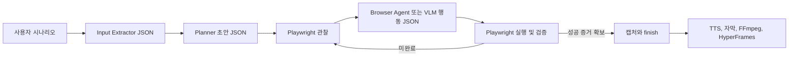

# Gemma 4 12B QAT 영상 생성 프롬프트 설계

## 목표

로컬 Ollama의 `gemma4:12b_qat`가 입력값 추출, 영상 절차 계획, 브라우저 화면별 행동 결정을 일관된 계약으로 수행하게 한다. 프롬프트가 해결할 수 없는 MCP 실행 모드, 렌더러, 영상 길이, TTS 설정은 런타임 사전조건으로 분리한다.

## 확인된 문제

1. Planner는 브라우저 관찰 전에 실행되므로 실제 화면에 없는 메뉴와 설명을 내레이션에 만들 수 있다.
2. 입력 추출기는 `input_values`만 읽기 때문에 요청문의 `5분`은 `target_video_duration_seconds`로 전달되지 않는다.
3. 현재 JSON 계약은 자연어 지시뿐이며, 형식 오류는 deterministic/local fallback으로 강등되어 원인이 잘 드러나지 않는다.
4. Browser Agent는 성공 증거가 약해도 `finish`를 선택하거나, 동작을 진행하지 않는 `capture_step`으로 max steps를 소비할 수 있다.
5. 전체 `body_text`와 최근 history를 반복 전달하므로 12B 양자화 모델에서 지연과 중요 정보 희석이 발생할 수 있다.
6. 최신 실행 환경은 MCP `manifest`, `playwright-webm` renderer, Page Agent 비활성 상태다. 프롬프트는 이 설정을 바꿀 수 없다.

## 설계 결정

하나의 마스터 프롬프트 대신 역할별 프롬프트를 사용한다.

- Input Extractor는 업무 화면에 실제로 입력할 값만 추출한다.
- Planner는 화면 구조를 추측하지 않고 의미 기반 초안만 만든다.
- Browser Agent는 현재 observation에 존재하는 증거만 사용해 한 번에 한 행동을 선택한다.
- VLM Browser Agent는 스크린샷과 DOM이 일치할 때만 selector 행동을 선택한다.

모든 역할은 다음 공통 규칙을 공유한다.

- JSON 객체 하나만 반환한다.
- 출력 schema에 없는 설명이나 Markdown을 반환하지 않는다.
- 관찰되지 않은 메뉴, 버튼, 결과를 만들지 않는다.
- 입력값은 제공된 key를 참조하고 새 업무 값을 발명하지 않는다.
- 성공 조건은 화면 증거와 성공한 action history로 확인한다.
- 실패한 locator/action을 그대로 반복하지 않는다.
- 로그인 정보, OTP, 토큰, 비밀번호를 생성하거나 요청하지 않는다.

## 데이터 흐름

## 프롬프트 밖의 필수 설정

- 원하는 영상 길이는 요청문만 믿지 않고 `MANUAL_AGENT_TARGET_VIDEO_DURATION_SECONDS`로 지정한다.
- 실제 MCP 리허설은 `MANUAL_AGENT_PLAYWRIGHT_MCP_MODE=live`가 필요하다.
- HyperFrames 렌더는 `MANUAL_AGENT_VIDEO_RENDERER=hyperframes`가 필요하다.
- DOM selector 우선 정책은 `MANUAL_AGENT_ENABLE_PAGE_AGENT=true`가 필요하다.
- fallback 원인 확인 시 `MANUAL_AGENT_STRICT_MODE=true`와 terminal log를 사용한다.

## 검증 기준

- 입력 추출 결과가 정확한 `input_values` JSON이다.
- Planner가 관찰되지 않은 UI 고유명사를 내레이션에 넣지 않는다.
- 모든 Planner action의 `step_id`가 존재하는 step을 가리킨다.
- Browser Agent는 현재 observation에 없는 selector나 text를 반환하지 않는다.
- Browser Agent는 한 번에 한 행동만 반환한다.
- `finish` 전 성공 action과 결과 화면 증거가 모두 존재한다.
- 응답이 현재 Python parser에서 `json.loads` 가능한 JSON 객체다.
