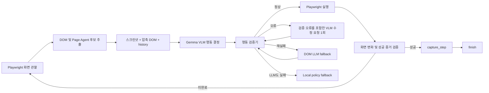

# 품질 최우선 매뉴얼 영상 파이프라인 설계

## 목표

로컬 Ollama `gemma4:12b_qat`와 Playwright를 사용해 사내 시스템 영상을 만들 때 잘못된 클릭, 화면 환각, 중복 자막, 음성·화면 불일치를 줄인다. 처리 속도보다 행동 정확성, 성공 증거, 최종 산출물 품질을 우선한다.

## 설계 원칙

1. 모든 의미 있는 브라우저 행동은 현재 스크린샷과 DOM observation을 함께 판단한다.
2. VLM 출력은 곧바로 실행하지 않고 관찰된 필드, 클릭 요소, selector, history와 대조한다.
3. Page Agent는 품질 최우선 모드에서 직접 행동을 결정하지 않고 DOM 기반 후보를 VLM context에 제공한다.
4. 같은 행동을 반복하거나 성공 증거 없이 종료하는 것을 상태 전이 검증기로 막는다.
5. fallback은 숨기지 않고 원인, 지연시간, payload 크기, 수정 요청 여부를 기록한다.
6. 최종 성공은 패키지 생성이 아니라 화면, 음성, 자막, 영상 검사까지 통과한 상태로 정의한다.

## 브라우저 판단 흐름



SSO, ADFS, SAML 리다이렉션은 VLM 호출 전에 인증 정책이 `wait`로 처리한다. 실제 로그인 화면은 기존 정책대로 자동 입력하지 않고 차단하거나 사용자 인증을 기다린다.

## 역할별 변경

### 입력 추출

- 개선된 Input Extractor prompt를 실제 호출에 적용한다.
- Ollama 호출은 JSON object response format을 사용한다.
- 검색어, 질문 같은 업무 입력만 유지한다.
- 요청문의 `5분`, `30초`, `1분 30초`를 `target_video_duration_seconds`로 별도 추출한다.
- 영상 길이를 화면 입력값으로 섞지 않는다.

### Planner

- 실제 화면을 보지 못한다는 제약을 system prompt에 명시한다.
- 존재가 확인되지 않은 메뉴, 위치, 결과를 narration에 만들지 않는다.
- 의미 기반 action만 생성하고 selector 확정은 Browser Agent에 맡긴다.
- action/step 참조와 허용 action을 코드에서 검증한다.

### Browser Agent와 VLM

- 품질 모드는 매 행동 턴에서 VLM을 우선 사용한다.
- observation은 body text, fields, clickables, headings를 상한 내에서 전달한다.
- Page Agent가 만든 `agent_name`, `selector`, `agent_role` 후보를 포함한다.
- VLM은 Ollama JSON object response format을 사용한다.
- 행동 검증기는 대상 존재, 금지 행동, 입력값 출처, 최근 반복, capture/finish 순서를 확인한다.
- 검증 실패 시 오류 코드와 허용 후보를 넣어 VLM에 한 번만 수정 요청한다.
- 수정 결과도 실패하면 DOM LLM, 마지막으로 local policy를 사용한다.

## 상태 전이 규칙

- `fill_by_label`: label 또는 selector가 현재 fields에 존재하고 value_key가 input values에 있어야 한다.
- `click_by_text`: text가 현재 clickables에 존재하고 금지 행동이 아니어야 한다.
- `click_by_selector`: selector가 현재 fields 또는 clickables에 존재해야 한다.
- `press_key`: 입력 성공 history 직후 Enter만 허용한다.
- `wait`: 500~30000ms 범위로 제한한다.
- `capture_step`: 직전 action이 capture가 아니어야 한다.
- `finish`: 성공 action, 현재 성공 증거, 성공 상태 capture 세 조건이 모두 있어야 한다.
- 최근 실패 또는 성공한 같은 대상 action은 화면 변화가 없으면 반복하지 않는다.

## 미디어 품질

- media plan은 성공하거나 검증된 action log만 사용한다.
- 같은 caption/narration과 의미상 중복되는 capture를 제거한다.
- 화면 동작별 TTS 길이를 계산해 replay 전·후 대기시간을 배분한다.
- 입력 narration은 실제 입력값 전체를 불필요하게 반복하지 않는다.
- 자막은 narration과 동일 timeline을 사용해 중복 출력을 막는다.

## 렌더 품질 게이트

- 최종 영상 파일 존재와 비어 있지 않은 크기를 확인한다.
- ffprobe가 가능하면 영상 길이, 오디오 stream, 해상도를 검사한다.
- TTS 총 길이와 최종 영상 길이 차이가 허용 범위 안인지 확인한다.
- 자막 burn-in 요청 시 렌더 metadata가 성공을 기록했는지 확인한다.
- 초반 흰 화면과 장시간 정지 화면을 기존 프레임 검사와 함께 감지한다.
- 실패는 `completed`로 숨기지 않고 package degradation 또는 quality failure로 기록한다.

## 관측성과 성능

품질 모드에서도 불필요한 토큰과 전송 비용은 줄인다.

- LLM/VLM 호출별 `elapsed_ms`, request bytes, response bytes, model, attempt를 기록한다.
- body text와 history는 의미 보존 상한을 둔다.
- 인증 대기, 동일 화면 재관찰처럼 모델 판단이 필요 없는 turn은 VLM 호출을 생략한다.
- VLM 수정 요청은 최대 한 번이다.
- Browser Agent max steps는 전체 기능 행동 수를 제한하되 SSO wait turn과 분리한다.

## 설정

새 실행 정책은 `MANUAL_AGENT_BROWSER_DECISION_POLICY=quality_first`로 선택한다. 상태 API와 홈 UI는 현재 정책, VLM 준비 상태, 수정 요청 및 fallback 발생 여부를 표시한다.

품질 최우선 권장 설정:

```env
MANUAL_AGENT_BROWSER_DECISION_POLICY=quality_first
MANUAL_AGENT_ENABLE_BROWSER_AGENT=true
MANUAL_AGENT_ENABLE_PAGE_AGENT=true
MANUAL_AGENT_BROWSER_AGENT_MAX_STEPS=12
MANUAL_AGENT_LLM_TIMEOUT_SECONDS=600
MANUAL_AGENT_PLAYWRIGHT_MCP_MODE=live
MANUAL_AGENT_VIDEO_RENDERER=hyperframes
MANUAL_AGENT_TTS_PROVIDER=supertonic
```

## 오류 처리

오류는 `validation_error`, `vlm_repair_failed`, `dom_llm_fallback`, `local_policy_fallback`, `media_quality_failed`, `render_quality_failed`처럼 구조화한다. 일반 모드는 inspect 가능한 패키지를 남기고 degradation을 표시한다. strict mode는 최초 품질 오류를 발생시켜 디버깅을 우선한다.

## 테스트 전략

1. Prompt contract: Ollama JSON payload와 역할별 system prompt가 적용되는지 검사한다.
2. Action validation: 존재하지 않는 selector, 금지 토글, 반복 클릭, 조기 finish를 차단한다.
3. VLM repair: 최초 invalid action 뒤 수정 요청이 한 번만 발생하고 유효 행동으로 복구되는지 검사한다.
4. Payload bounds: 큰 DOM과 history가 상한 내로 압축되며 필드와 selector가 보존되는지 검사한다.
5. Duration extraction: 한국어 분·초 표현을 media timeline에 전달하는지 검사한다.
6. Media quality: 중복 narration 제거, TTS timeline, replay 대기시간을 검사한다.
7. Render quality: 오디오 stream, 자막, duration drift, 비어 있는 영상 실패를 검사한다.
8. Regression: 기존 전체 pytest와 샘플 Playwright E2E를 실행한다.
9. Live model: 로컬 `gemma4:12b_qat`로 정상, 모달, 아이콘, SSO, 챗봇 시나리오를 검증한다.

## 완료 기준

- 전체 테스트가 통과한다.
- 로컬 Gemma 응답이 production parser와 action validator를 통과한다.
- 샘플 E2E에 capture, rehearsal, TTS, render 관련 fallback이 없다.
- 성공 조건 전 finish와 동일 action 무변화 반복이 없다.
- 최종 영상에 화면, 음성, 자막이 존재하고 timeline 차이가 허용 범위 안이다.

