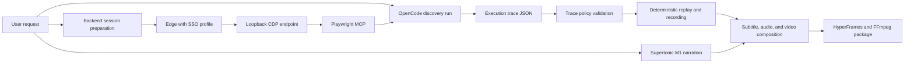

# OpenCode-Only Supertonic Pipeline Design

## Goal

Simplify the manual-video generator so OpenCode is the only agent intelligence, Supertonic is the only TTS provider, and the backend owns deterministic replay, recording, validation, redaction, and packaging.

## Decisions

- OpenCode replaces internal LLM/VLM API calls, RAG, reranking, input extraction, planning, and browser decision loops.
- OpenCode runs without `--model`; its own configured default model is used.
- The backend opens an Edge browser with the configured AD SSO profile and exposes a loopback CDP endpoint.
- A job-local Playwright MCP process connects to that CDP endpoint and is exposed only to OpenCode.
- OpenCode performs one discovery run and returns a structured execution trace.
- The backend validates and deterministically replays the trace for final recording.
- Supertonic preset `M1` is the only TTS path. TTS failure stops the pipeline; silent WAV and MeloTTS fallback are removed.
- OpenCode or trace validation failure stops the pipeline. No deterministic or LLM fallback generates a misleading video.

## Architecture



## OpenCode Runtime Boundary

Each job receives an isolated OpenCode workspace with a generated `opencode.json`. The configuration registers one local Playwright MCP server connected to the backend-owned CDP endpoint.

OpenCode permissions deny shell execution, file edits, web search, subagents, and unrelated tools. Only the Playwright MCP tools required for browser observation and safe navigation are allowed. OpenCode does not edit package artifacts. The backend captures OpenCode JSON events and writes the validated final response to `opencode_execution_trace.json`.

The OpenCode command is:

```text
opencode run --format json [--agent <configured-agent>] <prompt>
```

No `--model` argument is allowed.

## Execution Trace Contract

The trace uses a versioned Pydantic schema:

```json
{
  "schema_version": "1.0",
  "status": "completed",
  "request_summary": "Short request summary",
  "input_values": {"question": "example"},
  "steps": [
    {
      "id": "step_1",
      "title": "Visible step title",
      "narration": "Korean narration",
      "actions": [
        {
          "type": "fill|click|press|wait|capture",
          "selector": "observed CSS selector",
          "ref": "observed MCP ref",
          "label": "observed accessible label",
          "value_key": "input_values key",
          "observed_url": "https://allowed.example/path",
          "expected_after": "observable postcondition"
        }
      ],
      "evidence": {
        "before_screenshot": "step_1_before.png",
        "after_screenshot": "step_1_after.png"
      }
    }
  ],
  "completion_evidence": {
    "url": "https://allowed.example/path",
    "text": "Observed completion text"
  }
}
```

Passwords, OTP values, cookies, tokens, authorization headers, and SSO credentials are forbidden. Sensitive values are never serialized into the trace.

## Validation And Replay

Before replay, the backend validates:

- schema version and action count limits;
- target URL origin and redirect policy;
- selector/ref provenance from OpenCode evidence;
- ambiguous target rejection;
- dangerous write action policy;
- required screenshots and completion evidence;
- secret and personal-data redaction.

Only a valid trace reaches deterministic replay. Replay executes semantic actions through the existing browser runner against the same CDP session, records pointer/highlight overlays, and emits a replay log. It does not call OpenCode or any LLM during recording.

## Pipeline Simplification

The active pipeline becomes:

1. Validate request and prepare job.
2. Start or attach Edge/CDP session.
3. Run OpenCode discovery through Playwright MCP.
4. Validate execution trace.
5. Generate Korean narration with Supertonic M1.
6. Replay trace with narration-aware timing and record video.
7. Apply masking, subtitles, audio mux, HyperFrames/FFmpeg render, and package validation.

The following modules may remain temporarily as compatibility shims but are not reachable from the active pipeline: internal planner, input extractor LLM mode, browser-agent LLM/VLM loop, page-agent decision mode, RAG/reranker, MeloTTS, fake TTS, and silent-audio fallback.

## Failure Policy

- OpenCode missing, timeout, nonzero exit, invalid JSON, or missing trace: fail the job.
- Playwright MCP/CDP connection failure: fail the job and keep browser diagnostics.
- Trace validation failure: fail before replay.
- Supertonic model, preset, or synthesis failure: fail before render.
- Replay divergence: fail and retain before/after screenshots and the failing action.
- HyperFrames failure: report render failure; do not silently replace an explicitly required renderer.

Every failure writes a short support summary suitable for manual transcription in an isolated company environment.

## Test Strategy

- Contract tests for OpenCode JSON-event extraction and trace validation.
- Permission tests proving the job-local OpenCode config denies non-browser tools.
- CDP/MCP adapter tests for SSO-session reuse and cleanup.
- Replay tests proving no OpenCode or LLM call occurs during recording.
- Supertonic-only tests proving other providers and silent fallback are unreachable.
- Failure-injection tests for OpenCode, MCP, trace, Supertonic, and replay divergence.
- Existing package and security regression suites remain mandatory.

## Acceptance Scenario

Target: `https://qsike.com/`

Request:

```text
QSike Tech Notes 서비스를 소개하고, 홈 화면의 주제 영역과 최근 기술 노트를 이용해 원하는 기술 글을 찾아 읽는 방법을 설명한다.
```

Expected discovery and replay:

1. Open the QSike Tech Notes home page.
2. Introduce the service using only visible page evidence.
3. Show the topic cards and explain how to select an area of interest.
4. Select one recent technology note.
5. Show the article page and explain how to read its title, date, tags, and body.
6. Return a valid trace with screenshots and completion evidence.
7. Generate Korean Supertonic narration, synchronized subtitles, pointer/highlight overlays, and final video.

Acceptance requires a nonblank video with real QSike pages, no duplicated narration/subtitles, synchronized audio, and a package manifest that reports OpenCode, Supertonic, replay, and render as successful.
