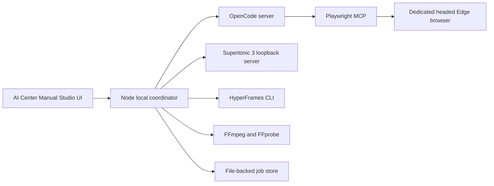
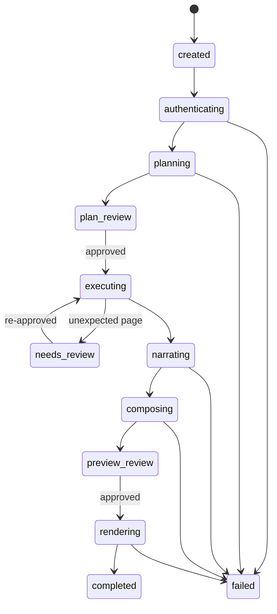

# OpenCode Manual Video Studio Design

**Date:** 2026-07-14
**Status:** Approved
**Target:** Windows local, single-user web service

## Goal

Build a new local web service from scratch that turns a target URL and a Korean natural-language request into an approved, narrated browser manual video. OpenCode is the only reasoning AI. Playwright MCP controls and records the browser, Supertonic 3 generates Korean narration, HyperFrames composes the final video, and FFmpeg/FFprobe normalize and verify media.

The existing `backend/` implementation is not imported, executed, or used as an architectural base. The new service lives under `studio/` and has its own startup, configuration, tests, artifacts, and UI.

## Approved Product Decisions

- Run as a local single-user Windows web service.
- Require the user to review and approve the operation plan before real browser execution.
- Support both manual login in a visible browser and locally stored automatic login.
- Keep OpenCode free of a forced `--model` flag; use its configured default model.
- Use no alternative LLM, VLM, TTS, browser automation engine, rendering engine, database, queue, or web framework.
- Use Node.js and Python only as the runtimes required to host the service and the selected tools.
- Execute one browser job at a time because a persistent Playwright profile cannot be shared safely by concurrent sessions.
- Never report a placeholder, silent audio file, or degraded substitute as a successful final video.

## Considered Architectures

### 1. Two-pass AI workflow — selected

OpenCode first explores the approved target and produces an editable plan. After the user approves that immutable plan, a separate OpenCode execution pass operates Playwright MCP and records the workflow. This preserves AI adaptation while maintaining an explicit approval boundary.

### 2. Single OpenCode session

One agent plans and executes in the same session. This is simpler but makes approval, recovery, and reproducibility weak.

### 3. Deterministic recipe replay

OpenCode creates JSON and a Node client replays MCP calls mechanically. This is reproducible but loses useful AI adaptation when a page changes.

## Architecture



### Node local coordinator

The coordinator uses Node built-in HTTP, URL, stream, crypto, filesystem, and child-process modules. It owns:

- static file serving and JSON APIs;
- Server-Sent Events for job progress;
- the job state machine and single-run lock;
- OpenCode process/session lifecycle;
- approval hashing and schema validation;
- Windows DPAPI credential encryption/decryption;
- Supertonic, HyperFrames, FFmpeg, and FFprobe process orchestration;
- retry, cancellation, timeout, cleanup, and artifact validation.

There is no FastAPI, Express, React, database, Redis, or external queue.

### OpenCode

A long-running loopback OpenCode server avoids restarting MCP for every phase. The coordinator invokes non-interactive runs in this shape:

```powershell
opencode run --format json --attach http://127.0.0.1:4096 --agent manual-video-planner "<prompt>"
opencode run --format json --attach http://127.0.0.1:4096 --agent manual-video-executor "<prompt>"
```

No `--model` flag is passed. Project-local agent configuration denies shell, edit, and unsafe browser-code tools while allowing the required Playwright MCP tools. OpenCode emits JSON events; the coordinator extracts the final structured result and stores the complete redacted event stream.

### Playwright MCP

Pin `@playwright/mcp` and run a headed Edge browser with:

- a service-owned persistent `--user-data-dir`;
- `1920x1080` viewport;
- a job-owned output directory;
- session saving and the devtools capability;
- video recording, tracing, action overlays, chapter markers, snapshots, and screenshots;
- unsafe arbitrary browser code disabled.

Accessibility snapshots and exact element references are the action evidence. Screenshots are artifacts and human review evidence, not the primary action-selection input.

### Supertonic 3

Run the official Python package as an unauthenticated loopback-only server on `127.0.0.1`. Use Python 3.13.14 because the default Python 3.14 runtime is outside the supported range. Synthesize one Korean WAV clip per approved scene, with `lang: "ko"`, a preset voice, and concurrency fixed at one.

### HyperFrames and FFmpeg

OpenCode creates structured scene and narration manifests, not unrestricted composition HTML. Application code compiles those manifests into a stable HyperFrames template. FFmpeg first normalizes the Playwright recording to 1920x1080, 30 fps, H.264, yuv420p. HyperFrames then composes scene cuts, narration, captions, chapter cards, zooms, and highlights. FFprobe performs the final media gate.

## Job State Machine



Every state transition is appended to `events.jsonl` and atomically persisted in `job.json`. A restart reconstructs the latest valid state from disk. Only explicitly resumable failed states expose a retry action.

## End-to-End Data Flow

1. The user submits a target URL, Korean prompt, authentication mode, voice, and video settings.
2. The coordinator validates the URL and creates `studio/data/jobs/<job-id>/request.json`.
3. Authentication completes before protected-page exploration.
4. The planner explores the page and writes a schema-validated `plan.json` through its final response.
5. The UI lets the user edit, reorder, or remove steps and narration.
6. Approval stores a SHA-256 digest of the canonical plan.
7. The executor receives the approved plan and digest, records video, and executes one step at a time.
8. Each step produces an action event, page evidence, screenshot, expected-result check, and time range.
9. Any unexpected page, domain, or outcome changes the state to `needs_review` instead of broad autonomous exploration.
10. Supertonic produces one WAV clip per scene.
11. FFmpeg normalizes the source recording and FFprobe measures source media.
12. The coordinator creates `media-plan.json`, captions, and a template-backed HyperFrames project.
13. HyperFrames lint/check and preview must pass before preview approval.
14. HyperFrames renders the final MP4.
15. FFprobe validates the output before the job becomes `completed`.

## Plan Contract

Each approved step contains only the behavior needed for a manual scene:

```json
{
  "id": "step-03",
  "action": "프로젝트 메뉴 열기",
  "expected": "프로젝트 목록이 표시됨",
  "narration": "왼쪽 탐색 영역에서 프로젝트 메뉴를 선택합니다.",
  "risk": "safe"
}
```

The complete plan also includes the target origin, success criteria, forbidden actions, capture settings, and a schema version. Unknown fields and unsupported actions are rejected.

## Authentication and Secret Handling

### Manual login

- Open the target in the dedicated visible browser profile.
- Set the job to `awaiting_manual_login`.
- Let the user finish login directly in the browser.
- Continue only after the user presses `로그인 완료` in the service UI.
- Preserve login state in the dedicated profile between jobs.

### Automatic login

- Encrypt stored credentials with Windows DPAPI for the current user.
- Never store plain credentials in `job.json`, plans, logs, HTML, or OpenCode prompts.
- Decrypt into a job-private temporary secrets file immediately before authentication.
- Pass that file through Playwright MCP's secrets mechanism.
- Delete it in a `finally` cleanup path on success, failure, timeout, and cancellation.
- Redact exact secret values and common credential keys from every captured process line.

The dedicated service profile is the default. Connecting to a user's normal browser profile is not part of the first release.

## Safety Boundary

- The target origin becomes the default domain allowlist.
- Navigation to an unapproved origin pauses the job.
- Plans containing delete, submit, send, publish, purchase, or equivalent irreversible actions are marked `blocked` until explicitly removed or separately approved.
- Execution is limited to the approved plan length plus bounded recovery observations.
- The approved plan digest must match before every execution or resume.
- OpenCode cannot use shell, edit, or unsafe arbitrary browser-code tools.
- The user can terminate the active OpenCode/MCP/render processes from the UI.
- Playwright MCP is treated as an automation tool, not a security boundary.

## Media Design

- Playwright MCP records the raw browser workflow and action annotations.
- Each approved step is a scene with start/end timestamps and a chapter marker.
- Supertonic returns 44.1 kHz WAV clips and authoritative clip duration metadata.
- FFmpeg normalizes raw browser video before composition.
- `media-plan.json` aligns browser ranges, narration clips, and captions.
- HyperFrames uses a pinned, deterministic template with no random, wall-clock, infinite, or network-dependent animation.
- HyperFrames runs `lint`, `check`, preview, then strict render.
- FFprobe requires 1920x1080, 30 fps, H.264 video, AAC audio, and expected duration tolerance.

## File Layout

```text
studio/
├── package.json
├── opencode.json
├── agents/
├── src/
│   ├── server/
│   ├── domain/
│   ├── adapters/
│   └── media/
├── public/
├── templates/hyperframes/
├── fixtures/login-site/
├── test/
├── scripts/
└── data/
    ├── jobs/<job-id>/
    ├── browser-profile/
    ├── credentials/
    └── cache/
```

Generated data, credentials, browser profiles, caches, and downloaded models are ignored by Git.

## UI Design

The UI follows the AI Center inspired design language without claiming official brand status.

### First viewport

- Visible `AI Center · Manual Studio` name.
- Light enterprise canvas with one origin-dot connection field.
- Purple-blue signal gradient reserved for the primary action and active workflow.
- A clear headline, target URL, prompt, login mode, and start action in the first viewport.
- No generic robot, brain, magic-wand, chip, or terminal-first imagery.

### Job workspace

- Left: authentication-to-completion workflow rail.
- Center: editable plan, live evidence, or video preview.
- Right: current actor, current step, elapsed time, tool health, artifacts, and actionable errors.
- Plan rows show action, expected result, narration, and risk.
- Execution view shows the latest screenshot and an immediate stop action.
- Preview review supports narration/caption edits and rerender from the media stage.

Cards use 8 px or smaller radii, controls use at least 44 px targets, and state never depends on color alone. Desktop uses a three-area layout; mobile becomes a single prioritized column without horizontal scrolling.

## Error Handling and Recovery

- Authentication expiration returns to authentication without deleting the approved plan.
- Page mismatch pauses at `needs_review` and preserves all evidence.
- OpenCode malformed JSON fails schema validation and exposes a bounded retry.
- Supertonic failure preserves narration text and marks only the affected scene retryable.
- HyperFrames lint/check/render failure exposes command output and the affected composition.
- Cancellation kills the process tree, runs secret cleanup, and leaves the job resumable where safe.
- No stage silently substitutes a different engine.
- Error responses include a stable code, human message, stage, retryability, and related artifact paths.

## Testing Strategy

Use Node's built-in `node:test` and `assert` modules for application tests.

### Unit tests

- state transitions and invalid transitions;
- schema and canonical plan hashing;
- origin and dangerous-action policy;
- OpenCode event parsing;
- redaction and artifact path containment;
- job lock and bounded queue behavior;
- FFprobe quality decision logic.

### Contract and integration tests

- child-process lifecycle, cancellation, and timeout;
- DPAPI round trip and temporary-secret cleanup;
- Supertonic health and Korean WAV response;
- HyperFrames manifest compilation, lint, check, and golden render;
- server restart and file-backed job recovery;
- SSE replay and reconnect behavior.

### Live end-to-end tests

The new service includes a local login fixture site. Both manual and automatic login flows must execute at least two approved browser steps through real OpenCode and Playwright MCP. The live path must create real screenshots, a real raw recording, Korean narration, captions, preview, and the final MP4.

The UI is visually checked at 1440x900 and 390x844. The first viewport must visibly show the AI Center identity, and neither viewport may overlap or scroll horizontally.

## Acceptance Criteria

- Browser execution cannot start before plan approval.
- An approved two-step scenario runs through real OpenCode and Playwright MCP.
- Both authentication modes work against the fixture site.
- Raw recording, screenshots, action events, and expected-result evidence exist.
- Final video is a non-placeholder 1920x1080, 30 fps H.264/AAC MP4.
- Korean narration and captions are present, with scene alignment within 500 ms.
- Secrets do not appear in any job artifact or process log.
- A simulated mismatch and a killed render can resume from their safe stages.
- The UI passes desktop/mobile and keyboard interaction checks.
- No new code imports or executes the existing `backend/` implementation.
- Automated tests, real-tool smoke tests, UI smoke tests, and `git diff --check` pass.

## Initial Version Pins

- OpenCode: local `1.4.1`, invoked without `--model`.
- Playwright MCP: `0.0.78`.
- Supertonic Python package: `1.3.1` with model `supertonic-3`.
- HyperFrames: `0.7.57`.
- Node.js: `22` or newer; local version is `24.13.1`.
- Python: `3.13.14` for Supertonic.
- FFmpeg/FFprobe: local `8.1.1`.

Pins are deliberate because Playwright MCP and HyperFrames change frequently. A version upgrade requires the live contract and golden-render tests.

## Non-Goals

- Multi-user or remote hosting.
- Parallel browser jobs.
- Cloud storage or publishing.
- Voice cloning or a custom voice marketplace.
- An additional LLM, VLM, TTS, browser driver, or renderer.
- Reusing the old FastAPI pipeline.

## Primary References

- [OpenCode CLI](https://opencode.ai/docs/cli/)
- [OpenCode MCP servers](https://opencode.ai/docs/mcp-servers/)
- [Microsoft Playwright MCP](https://github.com/microsoft/playwright-mcp)
- [Supertonic Python quick start](https://supertone-inc.github.io/supertonic-py/quickstart/)
- [Supertonic repository](https://github.com/supertone-inc/supertonic)
- [HyperFrames CLI](https://hyperframes.heygen.com/packages/cli)
- [HyperFrames repository](https://github.com/heygen-com/hyperframes)
