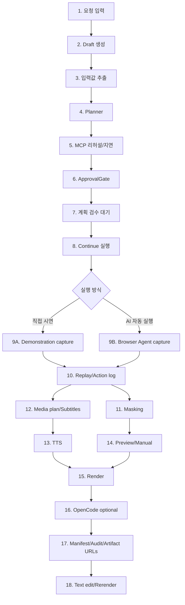

# Workflow-Based Codebase Structure

date: 2026-05-19
status: current-codebase-map
scope: Manual Video Agent MVP

이 문서는 현재 코드베이스를 기능 폴더가 아니라 실제 사용자 워크플로우 기준으로 정리한다. 개선 작업은 이 문서를 기준으로 어떤 단계의 책임을 바꾸는지 먼저 확인한 뒤 진행한다.

## Workflow Summary

`backend/app/workflow_graph.py`는 현재 파이프라인의 그래프 계약을 dependency-free로 표현한다. 각 node는 `step`, `actor`, `label`, `next_steps`, `optional`을 가지며, `workflow_state.json`은 현재 node와 전체 graph metadata를 함께 내보낸다. 향후 LangGraph를 도입하더라도 먼저 이 계약을 adapter로 compile하고, pipeline 내부 상태와 package contract는 유지한다.

## Layer Map

| Layer | Primary files | Responsibility |
|---|---|---|
| Web/API | `backend/app/main.py` | FastAPI endpoints, artifact routing, text artifact edit API |
| UI | `backend/app/templates/index.html`, `backend/app/static/app.js`, `backend/app/static/styles.css` | 요청 입력, 계획 검수, 실행/재렌더 버튼, workflow polling, artifact editor |
| Orchestrator | `backend/app/pipeline.py`, `backend/app/workflow.py`, `backend/app/workflow_graph.py` | workflow state, graph metadata, package dirs, planner/rehearsal/capture/TTS/render/opencode orchestration |
| Runners/Builders | `backend/app/browser_runner.py`, `backend/app/package_builder.py`, `backend/app/artifact_dependencies.py` | browser capture/replay decision boundary, media/preview/manual grouping, rerender dependency graph |
| Configuration | `backend/app/config.py`, `backend/app/env_bootstrap.py`, `.env.example` | `.env` parsing, safe config status, runtime path bootstrap |
| Adapters | `backend/app/adapters/*.py` | LLM/input extraction, browser agent, MCP, TTS, HyperFrames, OpenCode |
| Safety/Audit | `backend/app/policies.py`, `backend/app/action_safety.py`, `backend/app/audit.py`, `backend/app/redaction.py`, `backend/app/llm_logging.py`, `backend/app/terminal_logging.py` | risk classification, approval, redaction, audit events, terminal/LLM logs |
| Runtime scripts | `scripts/*.ps1`, `tools/verify_package.py` | no-Docker setup, bundle build, diagnostics, smoke, package validation |
| Tests | `backend/tests/*.py` | adapter contracts, pipeline behavior, debug regressions, security, runtime scripts |

## Step-by-Step Ownership

### 1. 요청 입력

- UI source: `backend/app/templates/index.html`, `backend/app/static/app.js`
- API input model: `PipelineInput` in `backend/app/pipeline.py`
- Fields: request text, target URL, role, completion condition, login mode, login success selector, execution mode, input values
- Current behavior:
  - 기본 샘플 입력값이 제공된다.
  - 입력값 row는 UI에서 추가/삭제 가능하다.
  - 실행 방식은 직접 시연과 AI 자동 실행 중 선택한다.
- Tests:
  - `test_home_ui.py`
  - `test_debug_history_regressions.py`

### 2. Draft 생성

- API: `POST /api/pipeline/draft`
- Entry point: `create_pipeline_draft()` in `backend/app/pipeline.py`
- Output:
  - `request.json`
  - `input_extraction.json`
  - `planner_trace.json`
  - `action_plan.json`
  - `rehearsal_log.json`
  - `approval_log.json`
  - `workflow_state.json`
- Current workflow state:
  - `status=awaiting_plan_review`
  - `current_step=plan_review`
  - `can_continue=true`

### 3. 입력값 추출

- Adapter: `backend/app/adapters/input_extractor.py`
- Current behavior:
  - 명시 입력값을 우선한다.
  - LLM 설정이 있으면 요청문에서 추가 입력값을 추출한다.
  - 민감 키는 redaction을 통과한다.
- Key risk:
  - 운영 시나리오에서 입력값이 누락되면 브라우저 단계에서 LLM이 화면을 보고 보완해야 하므로, 추출 결과와 브라우저 agent 입력의 계약을 더 명확히 해야 한다.

### 4. Planner

- Adapter: `backend/app/adapters/planner.py`
- Current behavior:
  - deterministic planner가 기본이다.
  - `MANUAL_AGENT_ENABLE_INTERNAL_PLANNER=true`일 때 OpenAI-compatible internal LLM planner를 호출한다.
  - RAG/Reranker는 설정에 따라 context로 들어간다.
  - Ollama OpenAI-compatible endpoint도 provider별 header 정책으로 처리한다.
- Artifacts:
  - `planner_trace.json`
  - `action_plan.json`
- Tests:
  - `test_adapters.py`
  - `test_config.py`

### 5. MCP 리허설/지연

- Adapter: `backend/app/adapters/rehearsal.py`
- MCP client: `backend/app/adapters/mcp_client.py`
- Current behavior:
  - `manifest` 모드는 실제 리허설이 아니라 실행 후보 MCP call manifest를 만든다.
  - `live` 모드는 stdio JSON-RPC MCP 서버를 실행한다.
  - 로그인 화면이 필요하면 live MCP는 draft 단계에서 지연된다.
- Artifacts:
  - `rehearsal_log.json`
  - `playwright_mcp_calls.json`
  - `playwright_mcp_execution.json`
- Key risk:
  - 로그인 이후 지연된 MCP 리허설을 본 실행 흐름 안에서 명시적으로 재개하는 사용자 피드백이 아직 약하다.

### 6. ApprovalGate

- Files: `backend/app/policies.py`, `backend/app/action_safety.py`
- Current behavior:
  - 위험 액션 후보를 분류한다.
  - MVP는 `sample-mvp` 승인 정책을 사용한다.
  - `approval_log.json`에 결과가 남는다.
- Key risk:
  - 운영 버전에서는 승인 로그가 아니라 실행 차단 게이트로 동작해야 한다.

### 7. 계획 검수 대기

- UI: `renderPlanReview()` in `backend/app/static/app.js`
- Continue API: `POST /api/pipeline/continue/{job_id}`
- Current behavior:
  - draft 산출물 링크와 승인 버튼을 표시한다.
  - 실행 중 UI는 `workflow_state.json`을 폴링한다.

### 8. Continue 실행

- Entry point: `continue_pipeline_draft()` in `backend/app/pipeline.py`
- Core orchestration: `_complete_pipeline_execution()`
- Workflow state:
  - `capture`
  - `mcp_rehearsal_after_login`
  - `replay`
  - `masking`
  - `tts`
  - `preview`
  - `render`
  - `opencode`
  - `manifest`
  - `completed`
- Failure state:
  - `status=failed`
  - `current_step=execution_failed`
  - `can_continue=true`

### 9A. 직접 시연 Capture

- Main file: `backend/app/pipeline.py`
- Current behavior:
  - 직접 시연 모드에서는 로그인 완료 버튼이 아니라 시연 완료 버튼을 사용한다.
  - 시연 이벤트를 action log로 기록한다.
  - 시연 원본은 최종 영상 재료가 아니라 클릭/입력 경로 참고로 사용하고, TTS 타이밍 기준 replay를 수행한다.
- Key artifacts:
  - `capture_action_log.json`
  - raw WebM
  - screenshots
- Tests:
  - direct demonstration tests in `test_pipeline.py`
  - debug history tests in `test_debug_history_regressions.py`

### 9B. AI 자동 실행 Capture

- Browser agent: `backend/app/adapters/browser_agent.py`
- Capture execution: `backend/app/pipeline.py`
- Current behavior:
  - LLM이 화면 observation과 사용자 요청을 보고 다음 동작을 JSON으로 반환한다.
  - web search toggle 같은 잘못된 버튼 선택은 차단/교정한다.
  - LLM이 비활성화되면 plan 기반 실행으로 degraded fallback한다.
- Key risk:
  - 실제 사내 시스템에서는 selector, iframe, SPA loading, SSO redirect, modal, role-based 화면 차이가 가장 먼저 깨진다.

### 10. Replay/Action log

- Main file: `backend/app/pipeline.py`
- Current behavior:
  - 직접 시연 이벤트를 media plan과 subtitles로 변환한다.
  - TTS 오디오 길이에 맞춰 replay 녹화한다.
  - replay 실패 시 원본 capture package는 inspect 가능하게 유지한다.

### 11. Masking

- Files: `backend/app/pipeline.py`, `backend/app/redaction.py`
- Current behavior:
  - 입력값과 민감 키워드를 기준으로 이미지/로그를 마스킹한다.
  - JSON 로그는 redaction을 통과한다.
- Key risk:
  - OCR 기반 프레임 마스킹, DOM/URL/네트워크 로그 redaction은 운영 수준으로 더 강화해야 한다.

### 12. Media Plan/Subtitles

- Main file: `backend/app/pipeline.py`
- Current behavior:
  - action log 또는 planner steps를 기반으로 `media_plan.json`과 `subtitles.vtt`를 만든다.
  - 텍스트 산출물 편집 후 rerender 시 subtitles 또는 TTS metadata를 재사용한다.

### 13. TTS

- Adapter: `backend/app/adapters/tts.py`
- Current providers:
  - `supertonic`
  - `melotts`
  - silent wav fallback
- Current behavior:
  - Supertonic은 preset voice만 허용한다.
  - OpenRAIL-M/AI 음성 고지를 metadata와 manual에 기록한다.
- Key risk:
  - silent fallback이 운영 검수에서 정상 음성처럼 오해되지 않도록 UI와 manifest의 degraded 표시를 더 강하게 보여야 한다.

### 14. Preview/Manual

- Main file: `backend/app/pipeline.py`
- UI editor: `backend/app/static/app.js`
- Current behavior:
  - `preview.html`, `manual.md`, `manual.pdf` placeholder를 만든다.
  - 텍스트 산출물은 모달에서 쉬운 보기/원본 편집이 가능하다.
  - 텍스트 편집 시 `artifact_edit_log.jsonl`에 before/after hash를 남긴다.

### 15. Render

- Adapter: `backend/app/adapters/video.py`
- Current behavior:
  - HyperFrames composition HTML을 생성한다.
  - HyperFrames CLI/FFmpeg가 가능하면 MP4를 시도한다.
  - 실패하면 WebM fallback 또는 기존 fallback video를 유지한다.
  - TTS audio mux를 시도한다.
- Key risk:
  - HyperFrames CLI, ffmpeg, audio mux 실패 사유가 UI에서 충분히 눈에 띄지 않는다.

### 16. OpenCode Optional

- Adapter: `backend/app/adapters/opencode.py`
- Current behavior:
  - 패키지 디렉터리에서 prompt와 metadata를 생성한다.
  - 활성화 시 `opencode` 명령을 실행하고 실패는 degraded로 기록한다.
- Key risk:
  - 운영에서는 read-only working copy, diff-only 결과, 사람 승인 후 반영 정책이 필요하다.

### 17. Manifest/Audit/Artifact URLs

- Main files:
  - `backend/app/pipeline.py`
  - `backend/app/audit.py`
  - `tools/verify_package.py`
- Current behavior:
  - package manifest에 supporting artifact, environment, degradations를 기록한다.
  - audit log는 actor/status/degrade reason 기반으로 남긴다.
  - `/artifacts/{path}`는 output root 내부 경로만 제공한다.
  - `/api/artifacts/text/{path}`는 텍스트 산출물 편집 API다.

### 18. Text Edit/Rerender

- API: `POST /api/pipeline/rerender/{job_id}`
- Entry point: `rerender_pipeline_package()`
- Current behavior:
  - capture를 다시 하지 않고 edited manual/subtitles/media metadata 기반으로 TTS, preview, render를 재생성한다.
  - rerender 이후 workflow state는 completed로 되돌린다.
- Key risk:
  - 편집된 텍스트가 어떤 산출물에 반영되었는지 UI에서 추적하기 어렵다.

## Cross-Cutting Contracts

### Workflow State Contract

`workflow_state.json`은 UI가 폴링하는 실행 상태 계약이다.

필수 필드:

- `status`: `awaiting_plan_review`, `running`, `completed`, `failed`
- `current_step`: `plan_review`, `capture`, `mcp_rehearsal_after_login`, `replay`, `masking`, `tts`, `preview`, `render`, `opencode`, `manifest`, `completed`, `execution_failed`
- `can_continue`: boolean
- `request`: redacted request payload
- `capture_browser`: boolean
- `environment`: redacted runtime fingerprint
- `updated_at`: ISO timestamp
- `details`: UI 표시용 redacted message와 actor

### Artifact Package Contract

검증 기준은 `tools/verify_package.py`와 `backend/tests/test_verify_package.py`가 소유한다.

핵심 파일:

- `package_manifest.json`
- `audit_log.jsonl`
- `action_plan.json`
- `approval_log.json`
- `rehearsal_log.json`
- `capture_action_log.json`
- `selector_trace.json`
- `support_log.md`
- `media_plan.json`
- `subtitles.vtt`
- `tts/tts_metadata.json`
- `video_render.json`
- `preview.html`
- `manual.md`
- `artifact_edit_log.jsonl` when text artifacts are edited

### Degraded Contract

실패해도 산출물 검수가 가능해야 하는 optional component는 failed보다 degraded를 우선한다.

대표 degraded reason:

- `browser_capture_disabled`
- `tts_silent_fallback`
- `hyperframes_fallback_video`
- `opencode_failed`
- `login_required`
- `demonstration_replay_failed`

## Current Test Coverage Map

| Workflow area | Test files |
|---|---|
| UI form/workflow/editor | `test_home_ui.py`, `test_debug_history_regressions.py` |
| config/env/status | `test_config.py`, `test_env_bootstrap.py` |
| planner/browser agent/MCP/TTS/video/opencode adapters | `test_adapters.py` |
| core pipeline and artifacts | `test_pipeline.py` |
| retry/idempotency/workflow state | `test_pipeline_operational_contract.py` |
| risk policy/redaction | `test_policy.py`, `test_redaction.py` |
| no-Docker runtime scripts | `test_runtime_scripts.py` |
| package contract | `test_verify_package.py` |

## Structural Gaps

1. `backend/app/pipeline.py` still contains low-level Playwright helper implementations, but capture/replay decision handling now has a `BrowserRunner` boundary.
2. Workflow state backend constants are centralized in `backend/app/workflow.py`; frontend maps the same contract in one `workflowUiState` object.
3. Browser Agent and Direct Playwright capture still share action semantics informally; a future deeper extraction can move low-level Playwright action execution out of `pipeline.py`.
4. Login-deferred MCP live rehearsal is now visible as `mcp_rehearsal_after_login`.
5. `RedactionPipeline` exists for text/JSON paths, but OCR-based frame redaction remains a future hardening area.
6. Text edit/rerender dependency graph is now recorded in `artifact_dependencies`.
7. `scripts/smoke.ps1 -LiveBrowser` provides local server + Playwright capture smoke; CI/nightly scheduling is still environment-specific.
